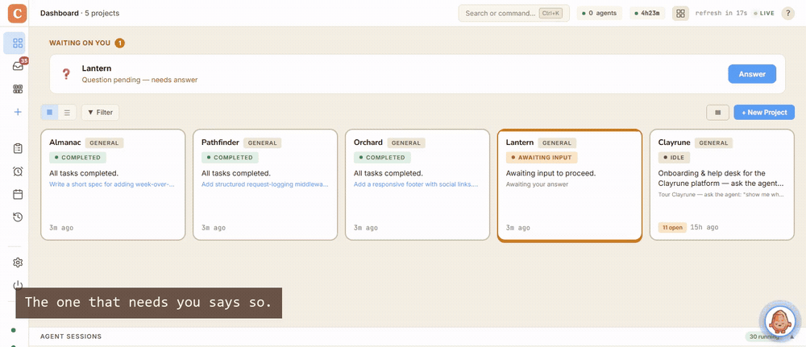
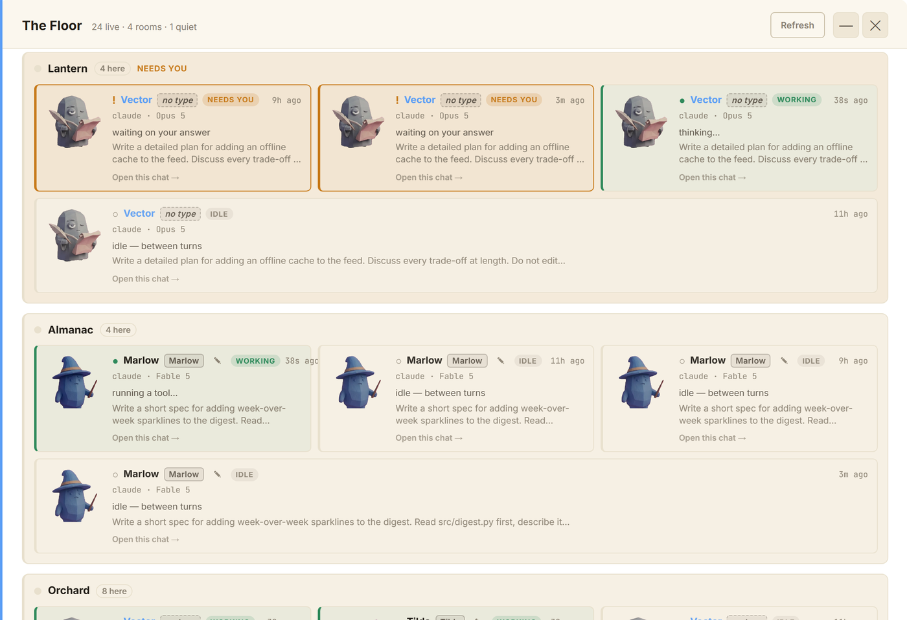
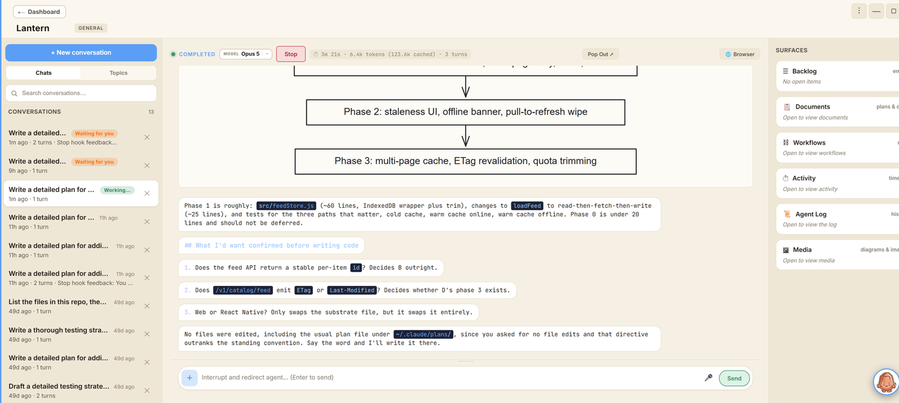
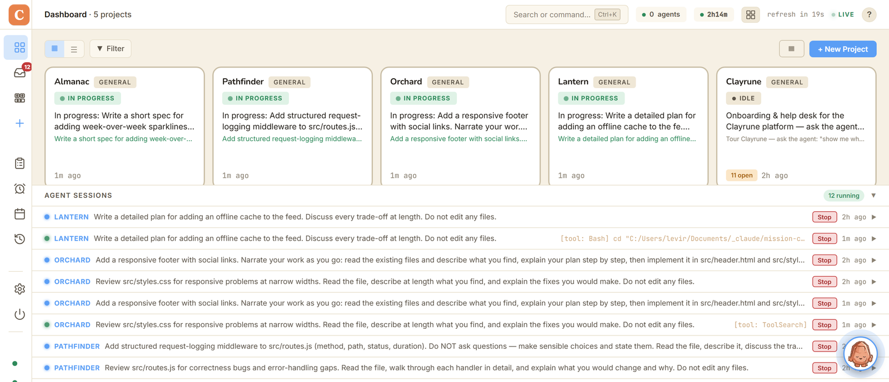

# Clayrune

**Mission control for your [Claude Code](https://docs.anthropic.com/en/docs/claude-code) agents.**
Run many agents, across every project, and keep working while they do.

[](LICENSE)
[](https://github.com/ronle/clayrune/commits)
[](https://clayrune.io/download.html)
[](https://clayrune.io/demo)



Four terminals open and you cannot tell which one stopped and is waiting on you.
Clayrune is a board over the sessions you already run: every project on it, every
agent named, and the ones that need you say so.

**[▶ Try the live demo — nothing to install](https://clayrune.io/demo)** &nbsp;·&nbsp; **[⬇ Download](https://clayrune.io/download.html)** — Windows, macOS, Linux

---

## Three things it does that are hard to copy

### It runs unattended with permissions skipped, and still won't `git push`

An unattended agent runs with `--dangerously-skip-permissions`, because stopping
to ask defeats the point. So the constraint lives in code instead:
[`steward/fence.py`](steward/fence.py) is a PreToolUse hook that hard-blocks **21
irreversible command shapes** — `DROP TABLE`, `rm -rf` outside scratch,
`git push`, `npm publish`, `terraform destroy`, `gh pr create`, cloud spend
verbs. It fails closed on an unknown session, and it blocks edits to its own
source, so an agent cannot quietly widen its own fence. 20 tests cover it.

Then it does the part nobody else does: **it emails you the command it stopped**,
waits, and feeds your reply back into the same run.

*Scope, because it matters:* the fence governs unattended steward cycles. Your
own interactive sessions are not fenced.

### Agents that remember, measurably

Cross-session memory is a common claim. We instrumented ours across **374 real
sessions** and found agents opened a memory file in **5%** of them — 91 of 104
notes were never read once. A retrieval layer that does not wait to be asked took
reachable notes from **47/104 to 97/104**.

Both harnesses live in [`tools/memory-eval/`](tools/memory-eval/) and re-run in
about a minute, against your own corpus.

### A fleet, not one agent

Every project on one board, each agent with its own persona, its own pinned
model, and its own session. A reviewer and a builder are genuinely different
agents rather than the same one re-prompted. Schedule them, or hand one a
standing charter and let it work overnight.

---

## What it looks like

| | |
|---|---|
|  |  |
| **The Floor.** Every live agent, grouped by the project it is working in, with a face, a name and the model it is pinned to. The ones marked `NEEDS YOU` are waiting on an answer. | **Inside a run.** Watch it work, read what it decided, and interrupt mid-task without killing the session. |



---

## Install

**Windows** — open PowerShell, paste one line:

```powershell
iwr https://clayrune.io/install.ps1 -useb | iex
```

**macOS / Linux:**

```bash
curl -fsSL https://clayrune.io/install.sh | sh
```

Installs the Claude CLI, clones Clayrune, and opens the dashboard at
`http://localhost:5199`. Prefer a double-click? There is a
[zip on clayrune.io](https://clayrune.io/download.html) — unsigned, so Windows
shows an "unrecognized app" notice once.

<details>
<summary><b>Running from source</b></summary>

Requires Python 3.9+ and the [Claude CLI](https://docs.anthropic.com/en/docs/claude-code/getting-started).

```bash
git clone https://github.com/ronle/clayrune.git
cd mission-control
pip install -r requirements.txt
python app.py        # native desktop window
# or: python server.py   → http://localhost:5199
```

First run walks you through port, project directory and model in Settings.
Full configuration reference: [`docs/reference-config-and-features.md`](docs/reference-config-and-features.md).

</details>

---

## Honest answers to the two questions everyone asks

<details>
<summary><b>"Isn't this just Claude Code?"</b></summary>

Clayrune doesn't replace Claude Code — it *runs* it. Claude Code is the engine;
Clayrune is the cockpit. You reach for it the moment you have more than one
project, more than one agent, or work you'd rather not sit and watch.

| Bare Claude Code | Clayrune |
|---|---|
| One repo, one terminal | Every project, one board |
| You're at the keyboard | Scheduled + unattended agents |
| Session ends, context dies | Cross-session memory |
| Desk-bound | Full control from your phone |

</details>

<details>
<summary><b>"What happens when two agents touch the same repo?"</b></summary>

Mostly they don't. Parallelism here is across projects: each project's agent gets
its own working directory and its own session.

For the case where two genuinely must share a repo, turn on **Worktree
isolation** in Settings (off by default). The second and any later concurrent
agent is dropped into its own git worktree on its own branch. Committed work
merges back at session end; if it does not apply cleanly, Clayrune keeps the
branch, does not auto-resolve, and says it needs a hand.

What that does *not* solve is two agents reasoning about the same file at once.
Worktrees stop them clobbering bytes. They do not stop the second agent building
on an assumption the first just invalidated. That part is unsolved.

</details>

<details>
<summary><b>Everything else it does</b></summary>

Multi-provider agents (Claude Code first-class, plus Gemini, Codex, Aider,
OpenCode, Goose) · Hivemind multi-agent orchestration · Scheduler (once / daily /
interval / cron) · autonomous Steward · backlogs with GitHub Issues sync ·
Skills and MCP server management · token and cost tracking · multi-window
layouts that survive a reboot · phone access with push over the clayrune.io
tunnel · plan viewer · shared rules across projects.

Detail: [`docs/reference-config-and-features.md`](docs/reference-config-and-features.md).

</details>

---

## Architecture, briefly

Python Flask backend, vanilla JS single-page frontend with no build step, JSON
files on disk with no database, and the `claude` CLI spawned as a subprocess with
streaming JSON output. One Python process, one HTML file, zero databases.

Contributions welcome — fork, branch, `python server.py`, verify, PR.
Notes in [`docs/reference-config-and-features.md`](docs/reference-config-and-features.md).

## License

[MIT](LICENSE), except two source-available-but-proprietary directories:
[`mc_remote/`](mc_remote/PROPRIETARY.md) and
[`mc_tunnel/`](mc_tunnel/PROPRIETARY.md), the closed platform-binding modules for
clayrune.io. The open-core seam is `mc_remote_iface/` (MIT) — implement that
contract to plug in your own remote-access provider.
Rationale: [`docs/remote-access/07-licensing.md`](docs/remote-access/07-licensing.md).
