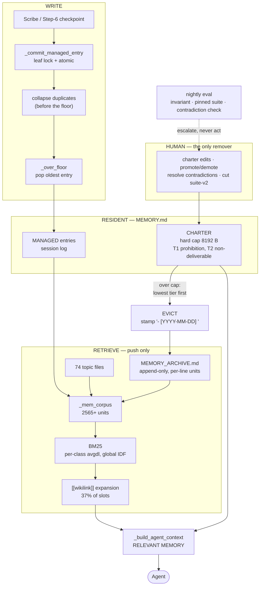

# Clayrune long-term memory — end-to-end redesign

**Backlog item:** `dae8d6e7` · **Date:** 2026-08-15 · **Status:** design, for Ron's approval
**Hivemind:** `hm_ea8bd971`, seats 1–5. Seat 5 (design) is the author of this file.
**Scope discipline:** analysis and written design only. No production code, no
`MEMORY.md`, no memory-dir edits were made. Prototypes are in `_scratch/seat5/`.

Supporting audits, each with its own measurements:

| seat | file |
|---|---|
| 1 | `docs/_committee/MEMORY_REDESIGN_seat1_retrieval_audit.md` |
| 2 | `docs/_committee/MEMORY_REDESIGN_seat2_write_path_audit.md` |
| 3 | `docs/_committee/MEMORY_REDESIGN_seat3_market_scan.md` |
| 4 | `docs/_committee/MEMORY_REDESIGN_seat4_dark_files_and_eval.md` |
| 5 | `docs/_committee/MEMORY_REDESIGN_seat5_design.md` (derivation for this file) |

**Every number below states its method or is labelled an estimate.** This item's
journal records three retracted claims, all from the same habit — treating a
convenient measurement as an answer without checking what it measured. Two more
retractions happened during this hivemind, one of them mine, and both are
recorded here rather than quietly dropped (§10).

---

## 1. The one-page version

The item proposed a two-level index whose leaves the agent opens on demand.
**That is disproved by measurement, not by argument:** 5% of sessions ever open a
memory topic file, 3% ever run a memory search, and 66 of 76 files have never
been opened in 264 sessions. Moving 70% of the index behind an agent-initiated
fetch would not page it out; it would delete it, silently, which is the exact
failure the item was filed about.

Four things the hivemind established that change the shape of the answer:

1. **The dark-file problem is half the briefed size and mostly a config value.**
   Live dark set is **15 of 74**, not 30 — the official probe omits the
   `expand=` argument production passes. `read_floor_topk` is live at **3** while
   the shipped code default is **6**; restoring it takes dark to **8**.
2. **The curated region is not a retrieval unit at all.** `_mem_corpus` indexes
   only the *managed* half of `MEMORY.md`. 16.8 KB — 73% of the always-loaded
   index — is simultaneously the most expensive content in the system and the
   only content the ranker cannot reach. **It is resident because residency is
   the only channel it has.**
3. **Curated has an automated writer and no automated remover.** `fold` inserts
   pointer lines into curated (117 lifetime operations against 96 present lines);
   `curated_rewrite` is rejected outright. Growth is machine-pumped and
   human-drained only.
4. **The escalation tier that was supposed to catch this is disabled by its own
   backstop.** The eviction floor is `cap − 1024` and the condense trigger is
   `> cap`, so the floor's job is to keep the trigger from ever firing. Zero
   `[condense]` log lines in the current window while dedup and watermark-GC fire
   freely.

**The design.** Residency stops being a property a line *has* and becomes a slot
a line *wins*, inside a hard byte cap, with eviction into a channel that already
works. Concretely: a fixed **8 KB charter** ordered by a mechanical priority rule;
everything else evicted into `MEMORY_ARCHIVE.md` in archive line-form so it
becomes a BM25 retrieval unit; the push path strengthened first so eviction is
provably safe; and one hard invariant — *no note may be both uncited and
unreachable* — gated in CI.

**Applied to today's 96 curated pointer lines:** 29 lines / **5,174 bytes** stay
resident against a **8,192-byte cap** (63% of cap, 3,018 bytes of headroom);
**67 lines / 10,849 bytes** are evicted. That is **~2,712 tokens saved on every
prompt, forever**, with no note becoming unreachable. Measured, §4.3.

---

## 2. The central constraint, and what it forbids

Reproduced by seat 4 against the brief, exactly, on 264 sessions
(`tools/memory-eval/retrieval_probe.py`, unmodified):

| | |
|---|---|
| sessions that read a memory topic file | 13 (5%) |
| sessions that ran a memory search | 7 (3%) |
| distinct topic files ever opened | 10 (23 opens; **10 of them `memory.md` itself**) |
| never opened in 264 sessions | **66 of 76** |

Against the **push** path — the read floor, auto-injected by
`_build_agent_context`, requiring no agent action — which reaches 59 of 74 topic
files at live settings and 66 at the shipped default.

> **CONSTRAINT P.** Any content moved behind an agent-initiated fetch is deleted,
> not paged. The pull path may be *improved*; it may never be *depended on*.

This is not our idiosyncrasy. Seat 3 found the same conclusion reached
independently by the vendors:

- **Letta's own best LoCoMo result came from a *forced* pull** — the harness
  required the agent to call `search_files` and keep searching until it answered.
  Their stated reason the filesystem approach won is that "simpler tools are more
  likely to be in the training data … and therefore more likely to be used" — an
  admission that tool-call likelihood, not retrieval quality, is the binding
  variable.
- **Anthropic's own memory tool ships a hard-wired forced pull** in the
  server-side system prompt ("ALWAYS VIEW YOUR MEMORY DIRECTORY BEFORE DOING
  ANYTHING ELSE"). They built a pure-pull memory, found the natural rate
  insufficient, and made it harness policy.
- **Claude Code's own auto-memory is the two-level design the item proposed**, with
  pure on-demand leaves and *no ranked push path at all*. Porting it to us would
  be a regression — our BM25 read floor is a capability it does not have.

**Corollary that follows from P and is easy to miss:** the fix for a dark file is
never "make the agent go get it." It is either *rank it higher on the push path*
or *keep it resident*. There is no third channel.

### 2.1 And the push path is one-shot

Seat 4 verified in code (`agent_routes.py:1915`, gated on `if task:`) and seat 1
inventoried the call sites: **13 recovery/respawn paths call
`_build_agent_context(p)` with no task**, so no read floor is injected at all —
and these are precisely the sessions that just lost their context. Worse, the
sticky-settings respawn at line 4981 writes that task-less context into
`session['_system_prompt']`, permanently stripping the floor from that session.

Measured over 263 transcripts: **1,368 of 1,628 user turns (84%) are served the
read floor computed from turn 1's task.**

So the honest framing is not push-good / pull-dead. It is **push-good,
one-shot, and leaky at the edges; pull-dead**. The 5% pull rate is what you would
expect when the only refresh mechanism is one the agent must invoke by hand.

---

## 3. E2E status of the system as it actually runs

Consolidated from seats 1 and 2. Verified against code, not against
`docs/MEMORY_SYSTEM.md` (which is the map, and is stale in 4 of 11 config rows
and omits `index_byte_budget` entirely — the key this whole item is about).

| mechanism | verdict | note |
|---|---|---|
| `_memory_search` BM25 core, per-class `avgdl`, global IDF | **load-bearing, healthy** | 12.9× class spread justifies the adaptation; no scoring defect found |
| `[[wikilink]]` expansion | **load-bearing, bigger than documented** | 37% of read-floor slots; +13 files at k=3; zero dangling targets |
| `MEMORY_ARCHIVE.md` | **load-bearing live index** | 96.5% of retrieval units, 15–20% of slots. *Not* cold storage |
| `_commit_managed_entry`, dedup, watermark GC | **load-bearing, firing** | 49 `[mem-dedup]`, 17 `[wm-gc]` lines; 2026-08-05 fix has not re-leaked |
| Scribe + Step-6 checkpointing | **healthy, dominant** | 476 / 1,844 extractions lifetime |
| `read_floor_topk = 6` | **silently inert** | `config.json` shadows the code default; live is 3 |
| Read floor on 13 recovery/respawn paths | **dead — never executes** | `task=''` ⇒ gate False, no log, no counter |
| Per-turn freshness of the read floor | **silently failing** | stale on 84% of turns; header still says "for this task" |
| **Curated region as a retrieval asset** | **dead by construction** | 73% of the index, excluded from `_mem_corpus` |
| **Structured condense** | **silently failing — cannot fire** | floor = cap−1024, trigger = >cap; the deadband is unreachable |
| `fold` (the only automated curated writer) | **insert-only pump** | 117 ops; `curated_rewrite_forbidden_v1` blocks removal |
| Watermark markers | **per-prompt tax** | 660 B each; 10.7% of budget during a 4-worker hivemind; they evict real entries |
| `read_floor_topk = 0` as a kill switch | **silently failing** | `scored[:max(1,topk)]` ⇒ always ≥1 |
| `_mem_tokens` docstring | **wrong about its own example** | `len(t)>=3` deletes the `mc` / `py` tokens it promises |
| `scribe_fell_back:parse_empty` | **diagnosed, not a defect** | correctly-classified trivial sessions; misleading name |

**The two that matter most to this design** are the two marked in bold. Together
they say: the expensive half of the index cannot be retrieved, and the machinery
that was supposed to escalate when it grew too large has been switched off by its
own safety net. The system did not fail loudly; it degraded from
*trim → condense → escalate to a human* to *trim forever*.

---

## 4. (a) What earns permanent residency

### 4.1 First: a mechanical *predicate* cannot deliver O(1). Measured.

I proposed one and tested it, and it failed. Recording that here because the
failure is what produced the right answer.

The hypothesis was that prohibitions ("never do X", "requires approval",
"RETIRED") are a property of the operator's standing policy rather than of the
project's topic count, and would therefore be flat while topics grow.

**Test** (`_scratch/seat5/claudemd_growth.py`): `CLAUDE.md` is the only
always-loaded, human-authored, version-controlled charter on this box — 29
commits, 2026-05-08 → 2026-08-15, with an explicitly stated residency bar ("an
agent that reads the code carefully still could not derive it"). Measured at every
commit:

| date | bytes | sections | prohibition sections | prohibition lines | total lines |
|---|---|---|---|---|---|
| 2026-05-08 | 1,056 | 2 | 0 | 0 | 20 |
| 2026-05-18 | 10,769 | 6 | 2 | 12 | 168 |
| 2026-06-09 | 22,439 | 12 | 6 | 18 | 346 |
| 2026-07-12 | 29,404 | 17 | 10 | 30 | 448 |
| 2026-08-05 | 34,427 | 19 | 12 | 38 | 524 |
| **2026-08-06** | **17,736** | **13** | **10** | **28** | **260** |
| 2026-08-15 | 19,273 | 14 | 11 | 30 | 279 |

Prohibition lines went 0 → 30 in 99 days, and in the mature window
(2026-05-27 → 2026-08-05) grew at ~0.35/day against curated-pointer growth of
0.167/day. **Prohibitions accumulate at least as fast as topics. The hypothesis
is falsified.**

> **The general result, which kills more than my own rule:** *no admission
> predicate can be O(1).* A predicate over a growing corpus admits a growing set,
> whatever the predicate is. This applies equally to the item's own proposal 2
> (evict on access statistics), to any relevance threshold, and to any editorial
> bar. **O(1) resident size is achievable only by a fixed budget plus a total
> order — admission must be competitive, not absolute.**

That is Letta's memory-block model (seat 3, steal #6: labelled, individually
byte-budgeted resident regions), and it is the actual answer to the item's root
cause. The item diagnosed "flat list, O(topics)" and proposed to fix the
*flatness*. The flatness is not the problem. **The absence of a cap is.**

### 4.2 The predicate's real job is priority — and one row above is the evidence

The 2026-08-06 row is a genuine forced-choice curation event: a human halved an
always-loaded file (`docs/CLAUDE_MD_ARCHIVE.md` records what moved out and why).
What survived:

| | before | after | survived |
|---|---|---|---|
| total bytes | 34,427 | 17,736 | 51.5% |
| sections | 19 | 13 | 68.4% |
| prohibition sections | 12 | 10 | **83.3%** |
| prohibition lines | 38 | 28 | **73.7%** |
| non-prohibition lines | 486 | 232 | 47.7% |

**Prohibition lines survived at 1.55× the rate of everything else, and their
share of the file rose from 7.3% to 10.8%.** When a human was forced to choose
what keeps permanent residency, what survived was disproportionately prohibition
content.

That is measured rather than asserted, and it coincides with the principled
reason:

> **The asymmetric-loss argument.** For a positive fact ("X works like this"), a
> ranking miss costs re-derivation — wasted work, recoverable. For a prohibition
> ("never do X", "this requires approval", "RETIRED, do not reinstate"), a
> ranking miss costs *the forbidden action* — possibly irreversible, possibly
> outward-facing, possibly a durable "no" being silently reversed. Same miss,
> different blast radius. **That asymmetry is the only thing that buys a line an
> unconditional delivery guarantee.**

### 4.3 The rule, and what it does to today's index

> ### RESIDENCY RULE
>
> The resident region (the **charter**) has a **hard byte cap**,
> `charter_byte_cap = 8192`. Lines are admitted in strict priority order until
> the cap is reached; the remainder is evicted. Priority is:
>
> **T1 — PROHIBITION.** The line matches the prohibition lexicon (a regex over
> the line: `BINDING | LOAD-BEARING | never | do NOT | must not | forbidden |
> RETIRED | DISABLED | requires approval/go-ahead/permission | do not
> reinstate/weaken/re-enable | only humans | ask first | overrides`).
>
> **T2 — NON-DELIVERABLE.** The line's knowledge is not reachable on the push
> path. For a linked line: its target file is dark over the pinned suite at the
> live config. For a link-less line: its distinctive tokens (df ≤ 3) do not
> concentrate in any single retrieval unit.
>
> **T3 — everything else.** Evicted.
>
> Ties inside a tier break by ascending byte length, so the cap admits the most
> lines it can hold.

Every predicate is a regex or a replayable measurement. **No editorial judgement
is required to run it** — which was the explicit requirement, editorial judgement
being the least-trusted piece of the current design.

**Applied to the live `MEMORY.md`** (`_scratch/seat5/allocate.py`; production
`_mem_split_full`, `_mem_corpus`, `_mem_tokens`; dark set from seat 4's
`classify.json` at topk=6 + expand=2):

| tier | lines | bytes |
|---|---|---|
| T1 prohibition | 17 | 3,203 |
| T2 non-deliverable | 12 | 1,971 |
| T3 evictable | 67 | 10,849 |
| **total curated pointer lines** | **96** | **16,023** |

| allocation at `charter_byte_cap = 8192` | |
|---|---|
| resident (all of T1 + all of T2 fit) | **29 lines, 5,174 B — 63% of cap** |
| headroom remaining | **3,018 B** |
| evicted to the retrieval corpus | **67 lines, 10,849 B** |
| **saved on every prompt** | **10,849 B ≈ 2,712 tokens** |

Three things worth reading off this table.

**The cap is not binding today.** T1 + T2 fit with 37% to spare. This is the right
moment to install the mechanism: it costs nothing now and it is the only thing
that makes the region O(1) later. Installing it after it binds means installing
it during a forced choice.

**When does it bind?** *(estimate)* T1 is 17.7% of lines; curated grows at 0.167
pointers/day (seat 2, clean 6-day window); mean T1 line is 188 B. So T1 grows at
~5.6 B/day and the 3,018 B of headroom lasts **~540 days**. T2 should *shrink*
toward zero as the push-path work in §5 lands, freeing another 1,971 B. Treat
540 days as an order of magnitude, not a date — the underlying growth signal is 6
days and one pointer.

**And when it does bind, nothing silently truncates.** The lowest-priority line
over the cap is evicted into a channel where it remains retrievable, and the
event is logged. That is the whole difference from today, where the file simply
grows and the escalation tier cannot fire.

### 4.4 The link-less lines — re-verified, as instructed

The brief flagged that ~39% of curated lines carry no link, so **the line is the
knowledge**, and that a prior session retracted a claim that this blocks the
design (33 of 37 recoverable from single archive units). I re-derived it rather
than reusing either number.

**Method** (`_scratch/seat5/admit.py`): for each link-less line, take its
distinctive tokens (df ≤ 3 across the live corpus) and ask whether ≥ 50% of them
concentrate in a *single* retrieval unit. Production `_mem_corpus` (2,565 units),
production `_mem_tokens`.

| | |
|---|---|
| link-less curated lines | **37** (5,928 B) |
| **recoverable from a single unit** | **31** |
| not recoverable | 1 |
| no distinctive token (undecidable) | 5 |
| recovering unit class | **archive 29, topic 2** |

**The retraction stands and reproduces.** 31/37 today against 33/37 on
2026-08-05 — same direction, same magnitude. The line-is-the-knowledge objection
does **not** block the design. The five undecidable lines are treated
conservatively as T2 (non-deliverable) by the rule, so they stay resident.

That 29 of 31 recover from *archive* units independently confirms seat 2's
finding that `MEMORY_ARCHIVE.md` is a live index, and it is what makes the
eviction target in §5.4 the right one.

---

## 5. (b) How to kill the dark files

The brief asked for 30. **The live number is 15**, established independently by
seats 1 and 4: `tools/memory-eval/scorer_ab.py:161` calls
`_memory_search(project, t, TOPK)` while production
(`agent_routes.py:1919`) calls it with `expand=read_floor_link_expand`, live at 2.
The probe measures a configuration nobody runs.

| configuration | reachable | dark | top-3 share |
|---|---|---|---|
| probe as written (topk=3, expand=0) | 46/74 | 28 | 49% |
| **LIVE (topk=3, expand=2)** | **59/74** | **15** | **33%** |
| code default (topk=6, expand=2) | 66/74 | 8 | 26% |
| best measured stack (topk=6 + archive quota + expand=2) | **67/74** | **7** | **23%** |

And seat 4's full-rank replay settles the cause: of the 28 dark files at
topk=3/expand=0, the best rank ever achieved was 4 for nine of them, 5–8 for
twelve more, and **zero files failed to score at any rank**. Not one file is
vocabulary-orphaned. **Rewriting notes is not the lever; ranking budget is.**

### 5.1 The remedies, by class

| class | n | remedy | cost |
|---|---|---|---|
| **A — benign redundancy** | 14 of 15 | **none.** Already carries a resident curated pointer; its fact is pushed on every prompt. Correctly dark *given* residency | zero |
| **B — genuinely lost** | **1** | `discovery_esc_no_apostrophe_inline_handler.md` — one wikilink from a frontend note | zero resident bytes |
| **C — link orphans** | 5 of the 8 residual (20 of 74 corpus-wide) | one wikilink each, in or out. Degree-(0,0) notes are invisible to expansion by construction | zero resident bytes |
| **D — ranking margin** | 7 of 15 live | `read_floor_topk` 3 → 6 in `config.json` | ~344 tokens/prompt |
| **E — deletion candidates** | **0** | delete nothing. `arch_memsearch.md` exists to stop agents reinstating memsearch; deleting it recreates the failure it prevents | — |

### 5.2 Free ranker levers, all measured offline by seat 4

| lever | effect | cost |
|---|---|---|
| `b` 0.75 → 1.00 (full length normalization) | dark 28 → 16 at topk=3 | **zero tokens** |
| title boost ×3 → ×1 (or exclude title tokens from the length count) | +2–3 files | **zero tokens** |
| archive soft down-weight / per-class quota | +9 files; concentration 49% → 41% | **zero tokens** |
| **reranking** | **46 → 41. Measured WORSE** | — recorded so it is not re-proposed |

The rerank result matters beyond this item: it is direct local evidence against
the market-scan case for a rerank stage. A query-coverage rescore promotes
documents touching many query terms shallowly over documents hitting one rare
term hard — the wrong trade for a corpus of file paths, function names and SHAs
where **the rare exact token is the signal**.

### 5.3 The coupling, and the ordering it forces

Seat 4's decisive measurement: **69 of 74 topic files (93%) are cited by a
resident curated pointer**, and 14 of the 15 dark files are among them. Exactly
**one** note in the corpus is reachable by neither path.

So the two layers are 93% redundant — **and they are redundant because residency
is curated's only channel.** That produces a hard ordering:

> **ORDERING CONSTRAINT.** Raise ranker reach *first*, verify, shrink curated
> *second*. Shrinking first converts benign dark files into real losses at a 1:1
> rate — which is precisely the silent deletion this item was filed about.

Every stage in §8 respects this.

### 5.4 The eviction trap — and the one-line fix

This is the most dangerous detail in the whole design, and I found it only by
trying to implement my own proposal. **Any** evict-curated scheme walks into it.

`mc/memory.py:568-570`, read not recalled:

```python
elif f.name == arch_name:
    for ln in txt.splitlines():
        if ln.strip().startswith('- ['):
            units.append((f.name, ln.strip(), 'archive'))
```

The archive is split into retrieval units by a filter requiring the literal
prefix `- [`. Measured on the live curated region:

| | lines | bytes |
|---|---|---|
| start `- [` → would be indexed | 59 | 10,095 |
| start `- ` → **would be silently dropped** | **37** | **5,928** |

Against my own eviction set of 67 lines: **39 would be indexed, 28 would be
silently dropped** — including the IPv6 dual-stack line, the PowerShell
Setup-Node pipeline-pollution line, the Session-JWT fails-open line, the
AskUserQuestion `mc:question` line. Exactly the link-less lines where the line
*is* the knowledge.

**Move such a line into the archive naively and it vanishes from both channels at
once**: no longer resident (not pushed), never a unit (not ranked). No error, no
log, no counter. It would look like a successful migration.

**The fix is one line at the eviction site and it pays twice:**

```
- Ron messages from his phone — prefer Telegram-style: short, conversational replies.
→  - [2026-08-16] Ron messages from his phone — prefer Telegram-style: short, conversational replies.
```

Stamping the eviction date into archive line-form makes it match the existing
filter with **no change to `_mem_corpus`, no new unit class, and no new `avgdl`
class**. That answers seat 3's caveat about inventing a shelf class and seat 2's
warning that any new `.md` in the memory dir becomes a topic-class unit and
pollutes IDF/`avgdl`. And the date stamp *is* the cheap temporal hygiene seat 3
ranked as steal #3, obtained free at the only moment it is knowable.

> **GATE.** No eviction stage may land until an assertion exists that every
> evicted line appears in `_mem_corpus` output as a scoring unit *after* the move.
> Count units before and after; the delta must equal the number of lines evicted.
> If not, the stage failed and rolls back.

---

## 6. (c) Bitemporal facts — REJECTED, explicitly

The brief asks whether facts should carry valid-from/valid-to so superseded ones
are invalidated rather than carried as true, citing "the retired memsearch line"
as evidence our index carries stale entries.

**I measured the incident. The premise is inverted.**

### 6.1 The resident index carries zero stale facts

Scanning all 96 curated pointer lines (production `_mem_split_full`) for
`RETIRED | DISABLED | deferred | non-functional | superseded | no longer |
unsupported` returns **five** lines. I checked all five — memsearch RETIRED, chat
reducer DISABLED 2026-06-12, Step 7 semantic search deferred, LAUNCH_PLAN
edge-worker deferred, CF per-session-revoke unsupported. **Every one is accurate
as of today.**

The memsearch line reads:

```
- [memsearch — RETIRED](arch_memsearch.md) — verified non-functional; do NOT use it.
  Use the Scribe system; operator channel → engram.
```

That is not a stale entry. It is a **correctly-marked tombstone**, and the fact it
asserts is true and current.

### 6.2 Where the staleness actually was

Measured from git (`git show <sha>:CLAUDE.md`, per-commit grep):

| date | commit | memsearch mentions in CLAUDE.md | marked retired |
|---|---|---|---|
| 2026-05-08 | `5c45c862` | 0 | 0 |
| 2026-05-18 | `f8d2af3f` | 8 | 0 |
| 2026-06-09 | `dfbf9eed` | 8 | 0 |
| 2026-07-12 | `9aa2f8fe` | 8 | 0 |
| 2026-08-05 | `a732c103` | 8 | 0 |
| **2026-08-06** | `2d8ee952` | **1** | **1** ← night review |
| 2026-08-15 | `5110cde1` | 1 | 1 |

Content at `a732c103`, verbatim:

```
271: ## memsearch — cross-session persistent memory layer (added 2026-05-14)
273: Claude Code has the `memsearch` plugin installed (Zilliz, MIT, v0.4.2+).
281: plugin's memory-recall skill / query memsearch for the topic *before*
```

Line 281 is a live instruction. memsearch was verified non-functional and retired
**2026-05-18**. `CLAUDE.md` — auto-loaded into every session exactly like
`MEMORY.md` — went on instructing every agent to use it for **80 days**.

### 6.3 The decision

**REJECT bitemporal facts.** Four reasons, in descending order of force:

1. **Wrong target.** The one incident we can point to was not a staleness failure
   in the store. The store had *already* invalidated the fact, in place, on the
   correct date. The failure was a **contradiction between two always-loaded
   surfaces that nobody compared**. Both had valid timestamps; both were
   internally consistent. `valid_to` does not detect that class of failure.
2. **No demand.** 0 of 96 resident lines are stale. Seat 3 measured ~12 genuinely
   superseded facts corpus-wide, with 38 of 50 marker hits inside the append-only
   archive where such prose is *correct*.
3. **Cost.** Seat 3 measured it: Graphiti performs multiple LLM + embedding calls
   **per write** (`getzep/graphiti` #1193, #1299) plus a graph database, to hold
   76 markdown files for one user. And the reference implementation shipped with
   its own valid-time plumbing wrong (#1489: `add_memory` discarded
   caller-supplied temporal context; `delete_episode` orphaned edges).
   **Bitemporal correctness is not free even for the people who invented the
   pitch.** This is the textbook case of complexity that pays only at 100× our
   scale, and we reject it on that basis explicitly rather than omitting it.
4. **We already have the useful half, and ours is push-delivered.** An in-place
   tombstone gives the entire benefit — a superseded fact served as
   *explicitly false* rather than silently true — and it stays resident, so it is
   pushed. A `valid_to` field would have to be **read** to matter, and reading is
   the 5% path. Under Constraint P, a bitemporal field is a fact we would be
   deleting.

### 6.4 What replaces it — two orders of magnitude cheaper

- **The tombstone convention, made explicit and required.** A retired fact is
  rewritten in place with its retirement and **never deleted** — deletion lets the
  agent reinstate it. This is already what `arch_memsearch.md` does and why seat 4
  recommends deleting nothing (Class E).
- **A cross-surface contradiction check, in the continuous eval.** For every
  resident line asserting `RETIRED`/`DISABLED`, grep the other always-loaded
  surfaces (`CLAUDE.md`, `SHARED_RULES.md`, `AGENT_RULES.md`) for un-marked
  mentions of the same subject. **That single check, run nightly, would have
  caught memsearch in May instead of August.** It is a grep. No timestamps, no
  graph, no model.
- **Keep `modified:` ISO-8601 frontmatter as hygiene** (seat 3, steal #3 — 74 of
  76 files already carry a frontmatter block, so it is a new key, not a schema
  migration). It is human-legible and cheap. It is **not** bitemporality and must
  not be sold as it: nothing auto-expires from a date.

---

## 7. (d) Is recall evaluated continuously? — Yes, and the current probes cannot do it

Today it is evaluated by hand, and the instruments are defective in three ways
seats 1 and 4 both found: they omit `expand=`, they hardcode `TOPK=3`, and their
headline metric **cannot go down**. "Reachable" is a cumulative-ever-hit count
over a task set that grows monotonically, so it drifts upward with the passage of
time whether or not retrieval improves. **It is unusable as a regression gate.**

### 7.1 The eval

**Check 1 — the invariant. The only hard gate on knowledge.**

> **No note may be simultaneously (a) absent from the resident charter and
> (b) unreachable by the ranker over the pinned suite.**

Today exactly one note violates it. This is the silent-knowledge-loss detector,
it measures the thing we actually care about, and it is the property every
migration stage in §8 is verified against.

**Check 2 — reachability and concentration on a pinned suite.** Replay
`_memory_search` **with the live call signature read from config**, over
`suite-v1`: 175 real dispatched tasks, extracted once and thereafter immutable.
Freezing the task set is what lets reachability go *down*, so it can gate. Growth
is handled by **versioning, not appending** — a `suite-v2` may be cut later and
the two are never compared; a release that cuts a new suite publishes both numbers
for one cycle.

**Check 3 — cross-surface contradiction** (§6.4). Reported, and escalated to the
human queue.

**Check 4 — the behavioural gold set. Reported, never gated.** Seat 4 built it and
then argued against trusting it: 12 sessions / 43 opens, of which 4 sessions were
*auditing the memory system* and bulk-read 5–11 files each. Excluding them leaves
**n=9**. The ordering across configs is monotone (weak evidence the signal is
real); the rate is not trustworthy. Reported honestly rather than dropped.

### 7.2 The gates

| check | metric | gate |
|---|---|---|
| 1 | notes uncited **and** unreachable | **HARD — must not increase** |
| 2 | zero-result rate | **HARD — must stay 0%** (it has been 0% for both scorers in every run) |
| 2 | `reachable@live-config` on `suite-v1` | soft — must not drop by > 2 files |
| 2 | top-3 concentration | soft — must not rise by > 5 points |
| — | evicted-line unit-count assertion (§5.4) | **HARD — delta must equal lines evicted** |
| 3 | cross-surface contradictions | reported + escalated |
| 4 | recall@floor, n=9 | **reported only, never gated** |

Soft = warning to the run log and the item journal. Hard = non-zero exit.

**Why continuous is not optional here:** seat 2 measured the archive growing at
2,691 B/day ≈ 8.5 new retrieval units/day. Every appended line shifts the archive
class's `avgdl` and the global IDF, so **BM25 scores are not stable over time**.
Recall can regress with no code change at all. Hand-checking cannot see that.

---

## 8. The mechanism, end to end



### 8.1 Write path

Unchanged in shape — seat 2 found the four-writer / leaf-lock / atomic-write
contract sound and no crack in it. Three additions:

1. **The charter cap is enforced at write time**, in `_mem_compose`, the same
   place `_over_floor` already runs. Over cap ⇒ evict lowest-tier-first, log the
   event.
2. **`fold` gains its missing half.** Today it inserts into curated and the code
   comments say "additive-only fold has no mechanical eviction path until v2."
   Under a cap, an insert that exceeds it triggers an eviction — the pump gets a
   drain. **This is the structural fix for seat 2's F3** and it is the strongest
   argument for the redesign, stronger than the item's own.
3. **The condense deadband is closed.** Floor and trigger must not be derived from
   one constant with the trigger on the far side of the floor. The trigger keys on
   **charter bytes**, which the floor provably cannot touch.

### 8.2 Storage layout

| what | where | why |
|---|---|---|
| charter (resident) | `MEMORY.md`, above the sentinel | unchanged location |
| session log | `MEMORY.md` managed region | unchanged |
| evicted charter lines | `MEMORY_ARCHIVE.md`, in `- [date] ` form | already per-line indexed; no new unit class, no `avgdl` risk |
| topic files | memory dir `*.md` | unchanged |
| **eval + residency state** | **memory dir, non-`.md` extension** (e.g. `_index_state.jsonl`) | seat 2 §9 |
| **pinned suite + baselines** | **`data/memory-eval/`, gitignored** | seat 4 §6.4 |
| **watermarks** | **move OUT of `MEMORY.md`** to the same non-`.md` sidecar | 660 B each of always-loaded index; they evict real entries |

### 8.3 Retrieval and injection

Unchanged in mechanism, strengthened in three places, all already implemented or
one-constant changes: `read_floor_topk` restored to 6; `b` → 1.00; title boost
→ ×1; archive per-class quota. Link expansion is preserved and invested in — it
is the only lever that improves reachability *and* reduces concentration, it
supplies 37% of slots, and it is a **push-path** mechanism, therefore immune to
Constraint P.

**Injection gets two repairs** (seat 1 recs 2–3): pass the task on the 13
recovery/respawn call sites, stop writing a task-less context into
`session['_system_prompt']` at 4981, and `_log` the swallowed exception at
1921 — which is the project's own stated exception-swallowing policy, currently
violated by this subsystem.

**Not recommended yet, and flagged as unmeasured:** per-turn read-floor refresh.
It is the largest measured gap (84% of turns) and the most build. Seat 1 measured
*staleness*, not *damage*, and says so. Gate it on evidence of harm.

### 8.4 Eviction

Mechanical, and the only automated removal in the system:

1. compute tier for every charter line (regex + replayable measurement);
2. admit in priority order until `charter_byte_cap`;
3. stamp the remainder `- [YYYY-MM-DD] ` and append to `MEMORY_ARCHIVE.md`;
4. assert unit-count delta == lines evicted (§5.4 gate);
5. log the eviction with the tier and the reason.

The archive is append-only and never truncated, so **eviction is reversible by
copying the line back**. That is the property that makes every stage in §9 safe.

### 8.5 What a human still does by hand

Deliberately, not residually. These are the places where the design refuses to
act autonomously:

- **Authors and edits charter lines.** The machinery can *evict*; only a human can
  *write* a resident rule.
- **Promotes an evicted line back**, if the eval or their own judgement says so.
- **Resolves cross-surface contradictions.** Check 3 escalates; it never edits
  `CLAUDE.md`.
- **Cuts `suite-v2`** when the task suite is judged stale.
- **Sets `charter_byte_cap`.** It is a budget decision, i.e. Ron's.
- **Fixes the 20 link-orphan notes** with one wikilink each — human-scale,
  reversible, zero resident cost, and it feeds the mechanism with the best
  measured yield.

---

## 9. Safety rails and the DATA_DIR rule

Per `CLAUDE.md`, these are load-bearing and each pins a violation that actually
happened on this machine.

**1. The authority guard — learning may never expand the agent's own authority.**
The design adds exactly one automated write capability: *evicting a line from the
charter into the archive*. It cannot author a charter line, cannot delete one,
and cannot promote one. So the machinery can only ever **reduce** what the agent
is told, never expand what it is permitted to do. There is no path by which
eviction grants autonomy, removes an approval gate, or widens a capability set.

Two consequences follow directly and are the reason the tiering is ordered as it
is:

- **T1 is the prohibition tier**, so the class of line the authority guard exists
  to protect is the *last* thing evicted, never the first.
- **Durable "no" is preserved mechanically.** A retired fact is tombstoned in
  place, never deleted (§6.4), because deletion is what lets a prohibition be
  silently reversed — the same failure shape as `_suppress_artifact` re-proposing
  `preference-1ba8d678`. A "no" that is evicted remains in the archive and remains
  retrievable; a "no" that is deleted is gone.
- **Seat 3's one safety rejection stands:** LangMem-style procedural memory — the
  agent rewriting its own instructions — is rejected on *safety*, not scale. It is
  precisely the capability `_authority_violation()` refuses.

**2. A human on at least one side of every loop.** The eval **escalates and never
acts**: hard gates fail a build, soft gates write a warning to the run log and the
item journal, and Check 3 raises contradictions to the human queue. No stage
closes a loop where an unattended agent's output becomes an unattended agent's
input. Note the specific risk this avoids: `fold` is machine-driven, and if
eviction were also machine-driven *and* charter authorship were machine-driven,
the resident region would be a fully autonomous loop. Authorship stays human, so
it is not.

Consistent with the standing rule that unattended cycles write to
`docs/_journal/<item-id>-<slug>.md`, never to the backlog note API — the eval's
per-run output goes to the journal and the run log.

**3. DATA_DIR pollution.** No new state goes in `data/projects/`.
`load_projects()` treats every non-suffix-excluded `*.json` there as a project;
a stray file becomes a malformed project and 500s
`_get_active_restart_blockers`, taking down both restart endpoints. Per seat 2's
ordering of options:

- residency/eval state → **memory dir, non-`.md` extension**. This satisfies the
  DATA_DIR rule *and* `_mem_corpus`'s `*.md` glob at once — a new `.md` there
  would become a retrieval unit and pollute class `avgdl` and global IDF.
- pinned suite + baselines → **`data/memory-eval/`**, structurally outside
  `DATA_DIR`, **gitignored** (it is verbatim operator task text — "would this be
  wrong on a stranger's machine?" applies directly), and **`build-macos.spec` must
  not be taught to package it** — that is the exact `SHARED_RULES.md` edge, where
  gitignoring was not enough because a build spec bundled the file anyway.
- **Nothing new goes inside `MEMORY.md`.** The watermark precedent costs 660 B per
  record of always-loaded index and evicts real entries; the design moves
  watermarks *out* rather than extending the pattern.

---

## 10. Migration plan

Ten stages. Each is independently verifiable against the two probes, each has a
measurable success criterion, and each is reversible by the stated action. The
**ordering constraint from §5.3 is binding**: stages 1–6 raise push-path reach;
only stage 7 onward touches the resident region.

| # | stage | success criterion | reverse |
|---|---|---|---|
| **0** | **Fix the instruments.** `scorer_ab.py` reads `read_floor_topk` and passes `expand=` from live config. Pin `suite-v1` (175 tasks) + commit `baseline-v1`. | Probe reproduces the live sweep (59/74, dark 15) instead of 46/74. Suite is byte-stable across two runs. | delete `data/memory-eval/` |
| **1** | **Add the invariant gate** (Check 1) + the unit-count assertion (§5.4). | Reports exactly **1** violation (`discovery_esc_no_apostrophe_inline_handler.md`). Fails on an injected synthetic violation. | remove the check |
| **2** | **`read_floor_topk` 3 → 6 in `config.json`**, verified via `GET /api/config` — *not* by editing the code default, which is inert on any install that persists the key. | `/api/config` reports 6 **and** the pinned-suite sweep reproduces 66/74, dark 8. | set it back to 3 |
| **3** | **Content fixes, zero resident bytes.** One wikilink for the Class-B note; one each for the 5 degree-(0,0) residual-dark files; then the other 15 link orphans. | Invariant violations 1 → 0. Isolated nodes 20 → 0. Reachability does not drop. | revert the edits |
| **4** | **Ranker constants, A/B'd one at a time:** `b` → 1.00; title boost → ×1; archive quota. | Each lands only if reachable rises and concentration does not, on `suite-v1`. Reject any that does not reproduce seat 4's offline number within 2 files. | one constant each |
| **5** | **Injection repairs.** Pass the task on the 13 recovery/respawn sites; stop stashing a task-less context at 4981; `_log` the exception at 1921. | Test asserts no `_build_agent_context` call site reachable from dispatch/respawn has an empty task. | revert |
| **6** | **Move watermarks out of `MEMORY.md`** to the memory-dir sidecar. | `MEMORY.md` shrinks by ~660 B × live sessions; managed capacity rises by the same; supersede still works across a restart. | write them back |
| **7** | **Index the charter as retrieval units — dry run only.** Compute the tiering; publish what *would* be evicted. **Change nothing.** | The T1/T2/T3 split reproduces §4.3 (17 / 12 / 67). Invariant holds for the *hypothetical* post-eviction state. | n/a — read-only |
| **8** | **Evict T3 in tranches of ~10**, stamped into archive form, newest tranche first. | After each tranche: invariant violations still 0; unit-count delta == lines evicted; `reachable@suite-v1` drops by ≤ 2; zero-result stays 0%. | copy the lines back from the archive |
| **9** | **Enforce `charter_byte_cap` at write time** + close the condense deadband (trigger keys on charter bytes). | An injected over-cap write evicts lowest-tier-first and logs it. `_should_condense` can now fire; a synthetic over-cap charter escalates to the human queue. | disable the cap check |
| **10** | **Nightly eval** on the local scheduler; Check 3 (cross-surface contradiction) added. | Runs in seconds against the cached suite. Reports the memsearch-class contradiction if one is injected. Writes to the item journal, never to the backlog note API. | delete the schedule |

### 10.1 How we prove we have not made recall worse

Four independent proofs, and none of them is "reachability went up":

1. **The invariant (Check 1) is the real proof.** Reachability is a proxy;
   *uncited AND unreachable* is the thing. It must be 0 after stage 3 and stay 0
   through every later stage. It is the only metric that directly measures
   knowledge becoming invisible.
2. **The pinned suite makes regression detectable.** With `suite-v1` frozen,
   `reachable` can fall — so a drop is a signal rather than an artifact. This is
   what today's probes cannot do.
3. **The unit-count assertion catches the specific way this migration would fail
   silently** (§5.4). It is the difference between an eviction and a deletion.
4. **Eviction is reversible by construction.** The archive is append-only and
   never truncated, so any tranche is undone by copying lines back. Stage 8
   proceeds in tranches precisely so a regression is bounded to ~10 lines.

And one thing we deliberately do **not** claim as proof: the behavioural gold set.
n=9, contaminated, monotone-but-untrustworthy. Reported, never gated.

### 10.2 A caveat on the growth model that this plan rests on

The urgency case comes from seat 2's projection (managed region squeezed to zero
≈ 2027-02-24). **I found and reported a contamination in one of its inputs**:
`_scratch/mem_plain.md`, used as the 2026-07-31 datapoint, is a *different
project's* memory index — 42 trading-content hits vs 11 mission-control, a
different heading structure, and 0 of 105 pointer lines carrying a link.

The **adopted rate of 28 B/day survives** — it came from the clean 2026-08-09 →
2026-08-15 window against a genuine backup, which I reproduce exactly (16,686 →
16,854 B, 95 → 96 pointers) — plus two journal cross-checks. What does *not*
survive is the inferred −2,853 B human-curation event, and with it the mitigating
evidence that humans periodically drain the region. **The only curated datapoints
we hold for this project both go up**, and seat 2's F3 (an insert-only pump with
no mechanical remover) is now the only measured directional force on curated.

That makes the case for a cap slightly *stronger*, on slightly *thinner* data. The
honest position: 6 days and 168 bytes of signal, two cross-checks, and anything
beyond ~90 days is an estimate. **The design does not depend on the date.** It
depends on the direction, which is measured, and on the structural fact that
there is no mechanical drain, which is read from code.

---

## 11. Explicitly rejected, with reasons

Per the brief's instruction to reject on the record rather than omit. Full
argument in seat 3.

| rejected | reason |
|---|---|
| **The item's own two-level index** | Moves ~70% of the index behind an action that happens in 5% of sessions. Deletes, does not page. Disproved by measurement |
| **The item's proposal 2 — evict on access statistics** | A badly-labelled note and an irrelevant note both read as cold: the eviction signal and the failure mode are the same event. Replaced by *evict on proven ranker reachability*, a deterministic replayable measurement |
| **Bitemporal facts / temporal knowledge graph** | §6. Wrong target, no demand, LLM+embedding calls per write for ~12 superseded facts, and the reference implementation had its own valid-time plumbing wrong |
| **Vector index / embeddings** | Weakest on exact tokens, which is most of our corpus. And this box has **no ML stack at all** — no numpy, no torch, no onnxruntime — so it means shipping a model file through a signed `.app` and three installers for 1 MB of markdown |
| **Cross-encoder rerank** | 568M params, 2–4 GB RAM, ~350 ms CPU, synchronously at dispatch, to reorder 6 of 76 results. And a cheap rerank measured **worse** locally (46 → 41) |
| **Hybrid BM25 + vector RRF** | +7.4% measured lift, on natural-language queries rather than identifier queries. Ours are `mc/memory.py`, `_build_agent_context`, commit SHAs |
| **Any vector or graph DB** (Neo4j, FalkorDB, pgvector, Milvus) | A database process for 76 markdown files belonging to one person |
| **RAPTOR tree construction** | UMAP + GMM + BIC over 76 points is statistically meaningless. Its *collapsed-tree* idea is adopted (§4); the tree is not |
| **mem0 / LangMem extraction pipelines** | One LLM call per write with no novelty gating, to classify facts a human already curated |
| **LangMem procedural memory** | **Rejected on safety, not scale** — the agent rewriting its own instructions is exactly what the authority guard forbids, after a real incident on this machine |
| **Letta archival tier + server** | Adds a service to run a pull path that fires 3% of the time |
| **Anthropic's memory tool as a replacement** | Pull-only, no ranked push path. Adopting it would be a downgrade from what we have |
| **Cursor-style account-level memory** | Solves a multi-user/multi-project problem we do not have |
| **Deleting any note** | Seat 4 found zero genuinely dead notes. `arch_memsearch.md` exists to stop memsearch being reinstated; deleting it recreates the failure it prevents |

**The scale rule, stated plainly:** this corpus is ~1,083 KB for one user. Nothing
in this design needs a vector store, an embedding service, a graph database, or a
rerank model. The one fashionable idea we tested locally measured worse. **The
mechanism that measured best is the `[[wikilink]]` layer we already built.**

---

## 12. Corrections made during this hivemind

Recorded because this item's failure mode is confident wrong numbers.

1. **"30 dark files" → 15.** The probe omits `expand=`, which production passes.
   Found independently by seats 1 and 4.
2. **`read_floor_topk` is 3, not 6.** Found independently by all four seats. The
   2026-08-05 shipped fix has never been in effect on this install.
3. **My own O(1)-predicate hypothesis, falsified by my own test** (§4.1) and
   replaced by the capped-competitive allocation, which is the better answer.
4. **`_scratch/mem_plain.md` is a different project's index** (§10.2), removing
   one row from seat 2's growth table and the sawtooth inference drawn from it.
5. **The archive filter is `- [`, not `- `** — a quote in seat 3 §5 has it wrong,
   and the difference is what makes §5.4 a silent-deletion trap rather than a
   detail.
6. **The brief's bitemporal example is inverted** (§6). The memory index carried
   the correct invalidation; `CLAUDE.md` carried the stale instruction, for 80 days.

---

## 13. Open, and honestly unmeasured

1. **Per-turn read-floor refresh.** Largest measured gap (84% of turns), entirely
   unmeasured as *harm*. Seat 1 says so explicitly and I am not overriding it.
2. **Whether indexing charter lines as units perturbs BM25 class statistics.**
   Mitigated by reusing the existing archive class rather than inventing one, but
   adding ~67 short units to a 2,476-unit class shifts its `avgdl` slightly. Stage
   8's tranching is what makes this observable rather than assumed.
3. **Whether the dark files would be reachable by embeddings.** Not measured. The
   gate before ever revisiting a purchase is seat 3's df ≤ 3 vocabulary-overlap
   test — an experiment, not an argument.
4. **`charter_byte_cap = 8192` is a proposal, not a measurement.** It is chosen to
   fit T1+T2 with ~37% headroom while restoring the managed region to ~15 KB
   (≈ 47 entries, ~2 weeks of session log, against today's ~16 entries / ~3 days).
   Ron's call.
5. **The 540-day cap-binding estimate** rests on a 6-day, one-pointer growth
   signal. Order of magnitude only.

---

# 14. MIGRATION PLAN — staged, reversible, one number per gate

**Seat 6 (`ws_006`), 2026-08-15.** §10 is the design's own ten-stage sketch. This
section is the version Ron approves or rejects **stage by stage**: every stage
carries one pre-stated success number, one pre-stated abort number, an exact
rollback action, an effort estimate, and a named human decision. Nothing here was
implemented; no production code, `MEMORY.md`, or memory-dir file was modified.

Where this plan **changes** §10 rather than elaborating it, it says so and why.

---

## 14.0 Three facts that reshape the sketch

### 14.0.1 `git revert` is not a rollback here — the memory dir is not merely untracked, it is outside the repo

Measured: `git check-ignore` on `MEMORY.md` returns
`fatal: … is outside repository at '<repo-root>'`.
The corpus lives at
`~/.claude/projects/<encoded-project-dir>/memory/`
— **76 files, 1,110,000 bytes** — a different tree entirely from the one git
watches.

So the plan has **two distinct rollback mechanisms and they are not
interchangeable**:

| what changed | rollback | covered by |
|---|---|---|
| `mc/memory.py`, blueprints, tools, tests | `git revert <sha>` + **server restart** | git |
| `config.json` values | `PUT /api/config` with the old value | live, no restart |
| `MEMORY.md`, topic files, `MEMORY_ARCHIVE.md` | **restore from a sha256-verified snapshot** | Stage 0b only |

A stage that touches both needs both. **Any stage from S5 onward that has no
valid Stage-0b snapshot behind it must not run.**

### 14.0.2 The eval harness currently reaps live cloudflared connectors

`tools/memory-eval/scorer_ab.py:130` runs `importlib.import_module("server")`,
which boots the remote-access supervisor **inside the probe process**.
`mc_remote/cloudflared.py:317 reap_orphans(*, keep_pid=None)` reads a shared
on-disk PID ledger and kills every recorded connector still alive — the live
server's included.

Measured today, one 42-second run of `scorer_ab.py`: **10** lines of
`reaped 1 orphaned cloudflared connector(s)` plus
`cloudflared is not alive; asking attest loop to re-issue`.
`retrieval_probe.py` (pure stdlib, never imports `server`): **0**.

This is the bug class `CLAUDE.md` already documents for `sweep_orphan_profiles()`
— a second process with an empty in-memory registry calls everything in the
shared ledger an orphan. The browser path got `SWEEP_ENABLED`; the cloudflared
path did not.

**Consequence:** §10's Stage 0 is not "fix the instruments", it is "**de-fang**
the instruments", and it is a hard prerequisite for every later stage, because
every later stage runs the probe. §10's Stage 10 (nightly eval) would otherwise
tear down Ron's remote access once a night, silently.

**A server-free harness is proven feasible — I ran it today.** `mc.memory.wire()`
takes `data_dir` / `memory_dir` / `claude_home` plus six dispatch callables that
read-only work never calls; passing no-op lambdas is sufficient. With
`state.CONFIG` loaded straight from `config.json`, `_mem_corpus` and
`_memory_search` both run correctly and **no supervisor starts**:

```
corpus units 2565  {'topic': 74, 'managed': 15, 'archive': 2476}
probe topk3 expand0  [discovery_index_byte_cap_curated_bloat.md, project_memory_system_redesign.md, arch_memory_link_layer.md]
LIVE  topk3 expand2  [... + arch_memsearch.md, decision_step7_semantic_search_deferral.md]
      topk6 expand2  [... 8 hits]
```

### 14.0.3 Longitudinal comparison cannot gate. Every gate is a **paired run**.

The single most important procedural change over §10.

Measured, same box, same day, **no code change**: the brief records
`scorer_ab.py` at 46/76 reachable, 30 dark, 49% concentration, 170 tasks. My run
hours later: **48/76 reachable, 28 dark, 48% concentration, 177 tasks.** The
metric moved **+2 files** and the task set grew **+7** in under a day, because
the task set is cumulative and the archive grows ~2,691 B/day, shifting `avgdl`
and global IDF.

Pinning the suite (§7.1) fixes the *task* half of that drift. It does **not** fix
the *corpus* half: replaying `suite-v1` next week against a larger archive still
gives a different number with no code change.

> **PAIRED-RUN RULE — binding on every stage in this plan.**
> A stage is verified by running arm A (unchanged) and arm B (the change)
> **in one process, against one frozen corpus snapshot**, and comparing them to
> each other. The stage's number is the A-to-B delta. A stage is **never**
> verified by comparing today's absolute number to a number recorded last week.
> Longitudinal numbers are kept, but only as drift telemetry — never as a gate.

Because BM25 here is deterministic and both arms see identical inputs, **the
noise floor of a paired run is exactly zero.** That is what lets the gates below
be stated as `delta >= 0` rather than `delta >= -2`. Anything looser would have
been guesswork; §10's "±2 files" is the right tolerance for the *unpinned*
probe, and I measured that it is, but paired runs make it unnecessary.

---

## 14.1 BASELINE — what we record today, before anything moves

Everything below was measured on this box on **2026-08-15**, method stated. This
is the artifact that later proves we did not make recall worse.

**B1 — pull-path behaviour.** `python tools/memory-eval/retrieval_probe.py`:

```
sessions scanned:                       266
sessions that READ a memory topic file: 13  (5%)
sessions that ran a memory SEARCH:      7   (3%)
distinct memory .md files ever opened:  10  (total opens 23)
Grep/Glob against the memory dir:       13
memory searches total:                  11
```

**B2 — push-path reach**, `python tools/memory-eval/scorer_ab.py` *as written*
(topk=3, `expand` omitted — a configuration nobody runs, kept only for
continuity with the historical series):

```
sessions 266 | real dispatched tasks 177 | trivial excluded 86 | topic files 76
OLD (tf)   reachable 19/76 | dark 57 | zero-result 0/177 (0%) | top-3 94%
NEW BM25   reachable 48/76 | dark 28 | zero-result 0/177 (0%) | top-3 48%
```

**B3 — corpus and index state** (server-free harness, production functions):

| quantity | value |
|---|---|
| `MEMORY.md` | **22,662 B** |
| curated region | **16,820 B (74.2% of the file)** |
| managed entries | 15 |
| watermark markers | **1** |
| `MEMORY_ARCHIVE.md` | 793,414 B |
| memory dir | 76 files / 1,110,000 B |
| `_mem_corpus` units | **2,565** — topic 74, managed 15, archive 2,476 |

**B4 — live config**, read from `GET /api/config`, not from a doc:

```
read_floor_topk 3 · read_floor_link_expand 2 · index_byte_budget 24576
index_line_budget 160 · index_line_hard_floor 185
condense_mode 'structured' · condense_threshold_kb 20
```

**B5 — volatility, so nobody later mistakes drift for damage.** `MEMORY.md` was
**23,547 B** at 18:41 (journal entry, this item), **22,795 B** and **22,662 B**
at two points in my own session. **It moves by hundreds of bytes within hours.**
Resident byte count is therefore reported, never gated, except as a paired
before/after inside one stage.

**Where the baseline lives.** Probe outputs are in `_scratch/seat6/` today, which
is gitignored *and* disposable. Stage 0b promotes them to the durable snapshot
root below. Until Stage 0b runs, **the baseline is not safe.**

---

## 14.2 The metrics, and what counts as a regression

| id | metric | how computed | gate |
|---|---|---|---|
| **M1** | `uncited_and_unreachable` — notes absent from the resident charter **and** unreachable by the ranker over `suite-v1` | Check 1 (§7.1) | **HARD.** Must never increase. Today **1** |
| **M2** | zero-result rate on `suite-v1` | scorer replay | **HARD.** Must stay **0/177 = 0%** |
| **M3** | `reachable@live-sig` on `suite-v1` | paired A/B | **soft.** Ranking stages: delta **>= 0**. Content/eviction stages: delta **>= -1** per tranche, **>= -2** cumulative |
| **M4** | top-3 unit concentration | paired A/B | **soft.** Delta **<= +2.0 points** |
| **M5** | evicted-line unit-count assertion (§5.4) | `len(_mem_corpus)` before vs after | **HARD.** Delta **exactly ==** lines evicted |
| **M6** | resident bytes (`MEMORY.md`) | `stat` | **reported.** A stage claiming a shrink must deliver >= 95% of its predicted shrink |
| **M7** | behavioural recall@floor, n=9 | seat 4's gold set | **reported, never gated.** Contaminated |
| **M8** | supervisor side effects | `grep -c cloudflared` on the eval's own stdout+stderr | **HARD.** Must be **0** from Stage 0 onward |

**Soft** = warn to the run log and `docs/_journal/dae8d6e7-*.md`. **Hard** =
non-zero exit; the stage does not land.

**Regression vs noise, stated as a number before any stage runs:** under the
paired-run rule the noise floor is **0**, so *any* negative M1/M2/M5 movement is
a regression. M3 and M4 carry the tolerances in the table because content stages
legitimately reshuffle ranks. On the **unpinned** probe — used only for drift
telemetry — the measured floor is **±2 files/day**, and nothing is ever gated on
it.

---

## 14.3 The stages

Ordering follows §5.3's binding constraint and tightens it: **S0–S4 change
nothing but ranking and instruments** (each reversible by one API call or one
`git revert`); **S5 onward touches note content**, which is reversible only from
a snapshot. Ron can stop after any stage and the system is in a coherent state.

Effort is **agent-hours** (one Clayrune session's work), with human decision time
counted separately. **[OPT]** marks a stage the plan works without.

---

### S0 — De-fang the eval harness · REQUIRED · ~4 h · no restart

Add `tools/memory-eval/_harness.py`: wires `mc.memory` directly (`wire()` with
no-op dispatch callables, `state.CONFIG` from `config.json`) so **no probe ever
imports `server` again**. Repoint `scorer_ab.py` at it. Add
`--corpus-snapshot <dir>` so both arms of a paired run read one frozen corpus.

- **SUCCESS (one number):** `grep -c cloudflared` over the harness's combined
  stdout+stderr = **0**, while a 30-query spot check returns hit lists
  **byte-identical** to the `import server` path (30/30).
- **ABORT:** any query where harness and server-import results differ. Then do
  not rewrite the harness — add an `MC_EVAL=1` env guard to the supervisor start
  in `server.py` instead, and re-verify.
- **REVERSE:** new files only, so `git rm` / `git revert`. Nothing live changes.
- **HUMAN GATE:** none. Pure instrument work.
- **NOTE:** the underlying `reap_orphans(keep_pid=None)` defect is **out of
  scope** for this item. File it separately; it is a remote-access bug, not a
  memory bug.

---

### S0b — Snapshot the corpus · REQUIRED · ~1 h · no restart

Add `tools/memory-snapshot.py`. Writes
`~/.clayrune/memory-snapshots/<ISO8601>-<label>/` containing every file in the
memory dir plus `manifest.json` (path, size, sha256) and the S0 baseline probe
outputs.

**Location reasoning, stated because it is a rule this repo enforces:** *not*
`data/projects/` (DATA_DIR pollution rule — `load_projects()` treats every
`*.json` there as a project and a stray file 500s both restart endpoints); *not*
`_scratch/` (disposable, and `.gitignore:292` makes it invisible rather than
durable); *not* the repo at all. `~/.clayrune/` is where this project already
puts durable operator state (secrets store, browser profiles, cloudflared PID
ledger).

**Copy order is load-bearing:** `MEMORY.md` **first**, then `MEMORY_ARCHIVE.md`,
then topic files. Floor eviction moves lines *out of* `MEMORY.md` and *into* the
archive; snapshotting in that order means a concurrent eviction yields at worst a
**duplicated** line, never a lost one. The reverse order can lose lines.
`_atomic_write_text` (temp+replace) guarantees each individual file is read whole.

- **SUCCESS (one number):** restoring the snapshot into a temp dir reproduces
  **76/76** files with matching sha256.
- **ABORT:** any sha mismatch, or a file count other than the live count. Do not
  proceed to any later stage — every rollback in this plan depends on this.
- **REVERSE:** n/a (creates only).
- **HUMAN GATE:** Ron confirms `~/.clayrune/memory-snapshots/` is an acceptable
  location and that snapshots are **never** committed.

---

### S1 — Pin `suite-v1` and `baseline-v1` · REQUIRED · ~2 h · no restart

Freeze the 177 real dispatched tasks to `data/memory-eval/suite-v1.jsonl`,
together with the explicit **list of transcript files** they came from, so
re-extraction is deterministic as new sessions land.

- **SUCCESS (one number):** two consecutive extractions produce a
  **byte-identical** suite file (sha256 equal) with **n = 177**, run at least one
  new session apart.
- **ABORT:** n differs between the two runs, which means extraction is reading
  the live session set rather than the pinned manifest. Fix before any stage
  gates on it.
- **REVERSE:** `rm -r data/memory-eval/`.
- **HUMAN GATE:** **Ron approves that verbatim operator task text is written to
  disk.** Three requirements ride on this, all from incidents this repo already
  had: (1) add `data/memory-eval/` to `.gitignore` — measured today, it is
  **not** currently ignored; (2) confirm `build-macos.spec` does not bundle it —
  gitignoring was *not* sufficient for `SHARED_RULES.md`, which the spec packaged
  anyway; (3) it must not land under `data/projects/`.

---

### S2 — Install the invariant and the assertions, read-only · REQUIRED · ~3 h · no restart

Implement Check 1 (M1), the M5 unit-count assertion, and the M8 supervisor
check, as `tools/memory-eval/eval.py`. **Reports only. Changes nothing.**

- **SUCCESS (one number):** reports **exactly 1** violation on the live corpus
  (`discovery_esc_no_apostrophe_inline_handler.md`, seat 4 §3), **and** reports
  at least 1 additional violation when a synthetic uncited-and-unreachable note
  is injected into a **copy** of the corpus. Both halves required — a check that
  cannot fail is not a check.
- **ABORT:** reports 0, or more than 1, on the live corpus. The implemented
  definition then differs from seat 4's; reconcile before proceeding. Do **not**
  adjust the gate to match the code.
- **REVERSE:** `git revert`. Read-only tool.
- **HUMAN GATE:** none.
- **ALSO RECONCILE HERE (do not skip):** seat 2's F4 says structured condense
  cannot fire because the floor is `cap-1024` and the trigger sits past the cap.
  My read of live config gives `condense_threshold_kb = 20` → trigger at
  **20,480 B** against a floor of **23,552 B**, and `_should_condense` compares
  `MEMORY.md + CLAUDE.md` combined, not `MEMORY.md` alone. **These two accounts
  are not obviously the same deadband.** S2 publishes which is true. S10 depends
  on the answer; this item's history says resolve it rather than assume.

---

### S3 — `read_floor_topk` 3 → 6 · REQUIRED · ~1 h incl. measurement · **no restart**

The single highest-value change in the plan, and the cheapest to undo.

Apply via **`PUT /api/config {"read_floor_topk": 6}`** — *not* by editing
`config.json`, and *not* by changing the code default (which is already 6 and has
been inert on this box since 2026-08-05, shadowed by `config.json`).

**Why no restart, verified from code:** `mc/blueprints/agent_routes.py:1917-1920`
reads `state.CONFIG.get('read_floor_topk', 6)` and
`state.CONFIG.get('read_floor_link_expand', 2)` **live, per call**. The key is in
`_CONFIG_EDITABLE_KEYS` and **not** in `_RESPAWN_TRIGGER_KEYS` (9 keys, all
agent-spawn flags). `update_config` mutates `state.CONFIG` in place *and*
persists. So the change is live at the next context build, for running sessions
too. **This stage does not need Ron's restart approval.**

- **SUCCESS (one number):** paired run on `suite-v1` — M3 rises by **>= +5 files**
  (seat 5's table predicts 59→66 at the live signature; seat 2 measured dark
  31→11 on the unpinned probe), with M1 not increasing and M2 still 0%.
- **ABORT:** M3 rises by **< +3 files**, or M4 rises at all, or `_memory_search`
  p95 latency rises by **> 50 ms**. Then revert.
- **REVERSE:** `PUT /api/config {"read_floor_topk": 3}`. One call, instant, no
  restart, no respawn. **Nothing else in the system changes state.**
- **HUMAN GATE:** **Ron accepts ~344 additional tokens per prompt** (seat 5 §5.1).
  That is the whole decision. It is a spend, not a risk.

---

### S4 — Ranker constants, one at a time · ~4 h + **1 restart** · [OPT per constant]

Three independent levers, each behind a **new config key defaulting to today's
behaviour**, so landing the code is a measurable no-op:

| key | default (= today) | candidate |
|---|---|---|
| `bm25_b` | `0.75` | `1.00` |
| `bm25_title_boost` | `3` | `1` |
| `read_floor_archive_quota` | `0` (off) | per-class quota |

- **SUCCESS (one number, per constant):** paired run — M3 rises by **>= +2 files**
  and M4 does **not** rise. Each constant is judged and landed alone.
- **ABORT (per constant):** M3 delta **< +2**, or it fails to reproduce seat 4's
  offline number within **2 files**. That constant is rejected and its flag stays
  at the default; the other two are unaffected.
- **REVERSE:** flip the key back via `PUT /api/config` — live, no restart. Code
  revert only if the flag plumbing itself is wrong.
- **RESTART:** **YES, once**, and only to load the three new keys into
  `_load_config()`'s defaults at `server.py:295`. **Batch this restart with S6.**
  Requires Ron's explicit go-ahead per `feedback-server-restart-approval`.
- **TRAP, verified:** `update_config` filters `if k in _CONFIG_EDITABLE_KEYS`. A
  `PUT` of an unlisted key returns **200 with `updated={}`** — a silent no-op.
  Every new key must be added to **both** the `server.py` defaults dict **and**
  `_CONFIG_EDITABLE_KEYS`, or the flag will appear to work and do nothing.
- **HUMAN GATE:** the restart. Otherwise mechanical.
- **DO NOT REVISIT:** reranking. Measured **worse** locally (46 → 41, seat 4).
  Recorded so it is not re-proposed.

---

### S5 — Wikilinks: the first stage that touches notes · ~3 h · no restart

Class B (1 note) + Class C (5 degree-(0,0) residual-dark) + the other 15 link
orphans = **21 notes, one `[[wikilink]]` each**, zero resident bytes.

**This is the ordering boundary.** Everything before it reverses with an API call
or a git revert. From here on, rollback means **restoring files from the S0b
snapshot**. Do not start S5 without a verified S0b.

- **SUCCESS (one number):** M1 goes **1 → 0** and link-orphans go **20 → 0**,
  with M3 delta **>= 0** on the paired run.
- **ABORT:** M1 > 0 after the edits, or M3 drops by 1 or more files. Restore the
  touched notes from the snapshot.
- **REVERSE:** `tools/memory-snapshot.py --restore <snap> --only <21 paths>`.
  **`git revert` does nothing here** (§14.0.1). Take a fresh snapshot
  `--label pre-S5` first.
- **HUMAN GATE:** **choosing each link target is a semantic judgement.** An agent
  proposes the 21 links as a diff; a human approves the list before it is
  written. This is the one place in the plan where a wrong automated choice
  creates a plausible-looking but wrong retrieval edge.

---

### S6 — Injection repairs · ~6 h + shares S4's restart

Seat 1's recs 2–3: pass the task on the 13 recovery/respawn call sites; stop
stashing a task-less context into `session['_system_prompt']` at 4981; `_log` the
swallowed exception at 1921 (the project's own exception-swallowing policy,
currently violated by this subsystem).

- **SUCCESS (one number):** a new test asserts **0** call sites reachable from
  dispatch/respawn build a context with `task == ''`, **and** the same test fails
  (reporting 13) when run against the pre-fix code.
- **ABORT:** any currently-passing test in `tests/` breaks. This stage touches
  session lifecycle, which has its own history of races.
- **REVERSE:** `git revert` + restart. Fully tracked code.
- **RESTART:** **YES** — batch with S4 into a single approval.
- **HUMAN GATE:** the restart.
- **NOT IN SCOPE:** per-turn read-floor refresh. Largest measured gap (84% of
  turns) and entirely unmeasured as *harm* (§13.1). Gate it on evidence, not on
  the size of the gap.

---

### S7 — Move watermarks out of `MEMORY.md` · [OPT] · ~5 h + 1 restart

§10 stage 6, **demoted to optional on measurement.** Seat 2's 660 B/watermark is
right, but the live count today is **1 watermark = 660 B = 2.9% of the index**.
The July incident (67 leaked, 37.8 KB) was already fixed by
`_gc_stale_watermarks` at startup (`49c09cc`). This stage buys ~660 B against a
real risk of breaking supersede, whose failure mode is duplicate `_(live)_`
entries filling the managed region — the exact 2026-08-05 incident.

- **SUCCESS (one number):** `MEMORY.md` drops by **>= 600 B** and a test proves
  supersede still drops the previous entry **across a server restart**.
- **ABORT:** any watermark lost in the move, or supersede failing once.
- **REVERSE:** snapshot restore **and** `git revert` **and** restart. Three
  mechanisms — which is itself the argument for deferring it.
- **RECOMMENDATION: defer.** Revisit if the live watermark count exceeds 5.

---

### S8 — Charter tiering, DRY RUN · REQUIRED before any eviction · ~4 h · no restart

Compute T1/T2/T3 for all 96 curated lines and **publish the list. Change
nothing.** Also publish, per line, whether it would be indexed after eviction —
i.e. run the §5.4 archive-filter check ahead of time on the hypothetical output.

- **SUCCESS (one number):** the split reproduces §4.3's **17 / 12 / 67** within
  **±2 lines per tier**, and the *hypothetical* post-eviction M1 is **<= today's
  M1**.
- **ABORT:** any tier differs by **> 5 lines** from §4.3. The tiering rule is
  then not reproducible across runs, and an unreproducible rule must not drive an
  irreversible move.
- **REVERSE:** n/a — read-only.
- **HUMAN GATE — the largest in the plan:** **Ron reads the 67-line eviction list
  and approves, edits, or rejects it.** Seat 5 §6.3 is explicit that the
  prohibition lexicon's precision/recall was never measured against a hand
  label. The dry run is where that gets human eyes, once, on a list that fits on
  a page.

---

### S9 — Evict T3 in tranches of ~10 · ~1 h per tranche × 7 · no restart

Newest lines first. Each line stamped `- [YYYY-MM-DD] ` so it matches
`mc/memory.py:568-570`'s `startswith('- [')` filter — **without which 28 of the
67 vanish from both channels silently** (§5.4). Snapshot before each tranche.

- **SUCCESS (one number, per tranche):** M5 delta **exactly ==** lines evicted
  (10), M1 still **0**, M2 still **0%**, M3 drop **<= 1 file** for the tranche and
  **<= 2 cumulative**.
- **ABORT (per tranche):** M5 delta **!=** lines evicted — **stop the entire
  stage**, not just the tranche. That inequality is the signature of the silent
  deletion this whole item was filed about.
- **REVERSE:** restore `MEMORY.md` from the per-tranche snapshot. The archive is
  append-only and never truncated, so the evicted lines are still there; the
  restore reinstates residency and leaves a harmless duplicate in the archive.
  **Bounded to ~10 lines per rollback by construction.**
- **HUMAN GATE:** **after tranche 1, a human decides go/stop** on the measured
  numbers, not on the plan's prediction. Tranches 2–7 then proceed unattended
  with the same gates.
- **KNOWN UNMEASURED (§13.2):** adding ~67 short units to a 2,476-unit archive
  class shifts that class's `avgdl`. Tranching is what makes the shift
  observable rather than assumed. If M3 degrades monotonically across tranches
  rather than randomly, that is the `avgdl` effect and the stage should stop
  early even inside tolerance.

---

### S10 — Enforce `charter_byte_cap` at write time · ~8 h + **1 restart**

Two new keys, **both defaulting to off**, so the code lands inert:

| key | default | meaning |
|---|---|---|
| `charter_eviction_enabled` | `false` | master switch |
| `charter_byte_cap` | `0` (= unenforced) | seat 5 proposes `8192` |

Plus the condense-deadband fix, keyed on whatever S2 established is actually true.

- **SUCCESS (one number):** with the flag **off**, `MEMORY.md` byte count is
  **unchanged (delta 0)** across 20 simulated writes; with the flag **on** in a
  test fixture, an over-cap write evicts lowest-tier-first, logs it, and M5 holds
  exactly.
- **ABORT:** any live `MEMORY.md` change while the flag is at its default. That
  proves the flag does not gate, and a cap that fires when it is off is strictly
  worse than no cap.
- **REVERSE:** `PUT /api/config {"charter_eviction_enabled": false}` — live.
  Code revert + restart only if the gate itself is broken.
- **RESTART:** **YES** — the two new keys. Ron's approval required.
- **HUMAN GATE:** **`charter_byte_cap` is Ron's number, not the plan's.** Seat 5
  §3.7 proposes 8192 and labels it a proposal, not a measurement: it fits T1+T2
  with ~37% headroom while restoring the managed region to ~15 KB. Lower it and
  T2 shrinks first. **This stage should ship with the cap at 0 and be flipped on
  in a separate, one-line decision.**

---

### S11 — Nightly eval on the local scheduler · [OPT, recommended] · ~2 h · no restart

`POST /api/schedules` with `schedule_type: daily`, running `eval.py` plus Check 3
(the cross-surface contradiction grep — the check that would have caught
memsearch's 80 days in `CLAUDE.md`).

- **HARD PREREQUISITE: S0.** Without it this schedule kills the tunnel nightly.
- **SUCCESS (one number):** **7 consecutive** nightly runs complete with M8 = 0
  and **zero** tunnel-downtime events in the same windows.
- **ABORT:** a single tunnel-downtime event coinciding with an eval run →
  `DELETE /api/schedules/<id>` immediately and reopen S0.
- **REVERSE:** `DELETE /api/schedules/<id>`.
- **HUMAN GATE:** none, but it **escalates and never acts** — output goes to
  `docs/_journal/dae8d6e7-*.md`, **never** to `POST …/backlog/<id>/note` (the
  binding rule added 2026-08-15, after the note API silently destroyed 3,855
  notes).

---

### S12 — Update `docs/MEMORY_SYSTEM.md` · REQUIRED · ~2 h · no restart

Seat 1 verified it row by row: the mechanism sections are correct, **4 of 11
config rows differ from live**. A map that disagrees with the territory is how
`CLAUDE.md` told every agent to use memsearch for 80 days after it was retired.

- **SUCCESS (one number):** **0** config rows differ from `GET /api/config`,
  checked by a test that reads both.
- **ABORT:** n/a.
- **REVERSE:** `git revert`.

---

## 14.4 Summary — approve or reject, stage by stage

| # | stage | effort | restart | reversal | opt |
|---|---|---|---|---|---|
| S0 | de-fang the harness | 4 h | no | git | — |
| S0b | snapshot the corpus | 1 h | no | n/a | — |
| S1 | pin `suite-v1` | 2 h | no | `rm -r` | — |
| S2 | invariant + assertions | 3 h | no | git | — |
| S3 | `read_floor_topk` 3→6 | 1 h | **no** | one `PUT` | — |
| S4 | ranker constants ×3 | 4 h | **yes (R1)** | flag → default | per-constant |
| S5 | 21 wikilinks | 3 h | no | **snapshot** | — |
| S6 | injection repairs | 6 h | **yes (R1)** | git | — |
| S7 | watermarks out | 5 h | yes | snapshot + git | **[OPT] defer** |
| S8 | tiering dry run | 4 h | no | n/a | — |
| S9 | evict T3, 7 tranches | 7 h | no | **snapshot** | — |
| S10 | `charter_byte_cap` | 8 h | **yes (R2)** | flag → off | — |
| S11 | nightly eval | 2 h | no | delete schedule | [OPT] rec. |
| S12 | fix `MEMORY_SYSTEM.md` | 2 h | no | git | — |

**Total ~52 agent-hours**, of which **S0–S3 is 11 hours and delivers the single
largest measured win** (`read_floor_topk`, seat 2: dark 31 → 11).

**Exactly two server restarts**, both batched, both needing Ron's explicit
go-ahead per `feedback-server-restart-approval`:

- **R1** after S4 + S6 — three ranker keys plus the injection repairs.
- **R2** after S10 — the two cap keys.

**Stop-after points that leave a coherent system:** after S3 (ranking improved,
nothing rewritten, one `PUT` undoes everything); after S5 (dark set killed, index
untouched); after S9 (index shrunk, cap not yet enforced).

## 14.5 Config keys — complete list, with defaults

| key | status | default | live today | target |
|---|---|---|---|---|
| `read_floor_topk` | exists | 6 (code) | **3** (`config.json` shadows) | 6 |
| `read_floor_link_expand` | exists | 2 | 2 | 2 |
| `index_byte_budget` | exists | 24576 | 24576 | unchanged |
| `bm25_b` | **new** | `0.75` (= today) | — | 1.00 if S4 passes |
| `bm25_title_boost` | **new** | `3` (= today) | — | 1 if S4 passes |
| `read_floor_archive_quota` | **new** | `0` (off) | — | per S4 |
| `charter_eviction_enabled` | **new** | `false` | — | Ron's call |
| `charter_byte_cap` | **new** | `0` (unenforced) | — | 8192 proposed |
| `memory_eval_enabled` | **new** | `false` | — | true after S11 |

**Every new key defaults to current behaviour.** Landing the code is a no-op;
behaviour changes only when a human flips a flag. That is the reversibility spine
of the whole plan.

## 14.6 Test files to add

| file | pins |
|---|---|
| `tests/test_memory_eval_harness.py` | harness parity with the server-import path; **asserts no supervisor module is imported** |
| `tests/test_memory_invariant.py` | Check 1; must detect an injected synthetic violation |
| `tests/test_memory_eviction_units.py` | **the §5.4 trap** — a `- [date] ` line becomes a `_mem_corpus` unit; a plain `- ` line does **not**. Pins the exact failure mode as a test |
| `tests/test_memory_charter_tiering.py` | T1/T2/T3 regex stability across runs |
| `tests/test_memory_charter_cap.py` | flag-off is a byte-for-byte no-op; flag-on evicts lowest-tier-first |
| `tests/test_memory_context_task_present.py` | no dispatch/respawn site builds a task-less context |
| `tests/test_config_keys_editable.py` | every new memory key is in **both** the defaults dict **and** `_CONFIG_EDITABLE_KEYS` (the silent-no-op trap) |
| `tests/test_memory_search_bm25.py` | **extend**: golden ranking unchanged when the new ranker flags sit at their defaults |

## 14.7 How we prove we did not make recall worse

Five proofs, in decreasing strength. None of them is "reachability went up."

1. **M1, the invariant.** *Uncited **and** unreachable* is the only metric that
   directly measures knowledge becoming invisible. 1 today, 0 after S5, 0
   forever. Hard gate on every subsequent stage.
2. **The paired-run rule (§14.0.3).** Both arms in one process against one frozen
   corpus makes the noise floor **0**, so a 1-file drop is a real 1-file drop.
   This is what today's probes cannot do, and it is why the gates can be tight.
3. **M5, the unit-count assertion.** The difference between an eviction and a
   deletion, expressed as an equality that either holds or does not.
4. **Reversibility by construction.** The archive is append-only and never
   truncated; every note-touching stage carries a sha256-verified snapshot; every
   config change is one `PUT`. **No stage in this plan destroys data.**
5. **Tranching.** S9's blast radius is ~10 lines. A regression is caught within
   one tranche and undone within one tranche.

And the thing we deliberately do **not** claim as proof: **M7, the behavioural
gold set.** n=9, contaminated by 4 sessions that were auditing the memory system
and bulk-read 5–11 files each. Reported every run. Gated never.

## 14.8 What this plan does not cover

- **The `reap_orphans(keep_pid=None)` defect itself.** S0 routes around it; it
  remains a live remote-access bug and needs its own backlog item.
- **Per-turn read-floor refresh.** Largest measured gap, unmeasured as harm.
- **Whether evicting T3 degrades agent behaviour.** Nobody in this hivemind
  measured behaviour; seat 4 tried and reported the attempt as a negative result.
  M1 is a proxy for harm, not a measurement of it (§13, seat 5 §6.5).
