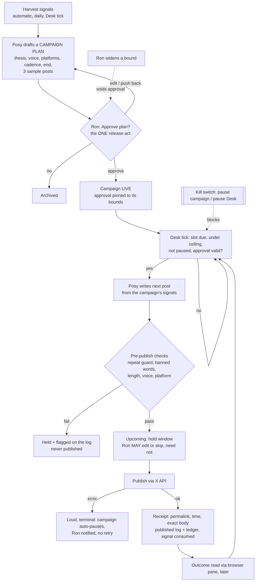

# The Desk: audit and simplification plan

**Status:** plan, 2026-09-22. Author: Merrin (ui-program-manager). No product code changed.
**Trigger:** Ron, 2026-09-22: *"The Desk as it stands right now is still unusable. It needs
further simplification and a holistic approach to allow easy publishing and fully autonomous
campaigns."*
**Release policy (decided by Ron, 2026-09-22):** **per-campaign.** Ron approves a campaign's
plan and voice once, and its posts then publish on the cadence with no per-post tap. There
is a kill switch (pause one campaign, or the whole Desk, instantly) and a published log. The
per-post variant survives only as the state a campaign is in **before** Ron approves it.
**Still binding:** the Desk can never grant itself release (only Ron approving a campaign
does that). No reply automation or engagement farming. X and LinkedIn only. The `clayrune`
voice posts to the Company Page, which is gated on LinkedIn's `w_organization_social` review.

Companion docs: `docs/THE_DESK_SPEC.md` (amended in the same commit, see §6), and
`docs/THE_DESK_UI_BRIEF.md`, whose §3 release rail and §5 Calendar this plan supersedes.

---

## 1. Audit: the live Desk, end to end

Walked on the running app (`localhost:5199`, main checkout at `aa9ea7b`) with a read-only
Playwright script, `_scratch/desk-audit/capture.mjs`. It clicks nothing that mutates state or
dispatches an agent. Screenshots are in `_scratch/desk-audit/` (gitignored): `01-board`,
`03-queue`, `03-calendar`, `03-ledger`, `04-voices`, `05-new-campaign`, `06-phone-board`.
The live state was read from `/api/desk/*`, `/api/schedules`, `/api/workflows` and
`/api/secrets` (metadata only).

**Live state on 2026-09-22:** 1 campaign ("Clayrune promotion", running, `planned: []`),
498 signals (0 consumed), 5 proposals sitting in `proposed` since 2026-09-10, 1 accepted, 0
ledger rows **ever**, both voices at 0 learned rewrites, no Desk workflow and no Desk
schedule. The Queue holds 3 drafts, all created 2026-09-08 in `clayrune_website` before the
Desk existed. They target discord, facebook and linkedin, carry no voice and no signal, and
two of the three platforms are outside v1.

### 1.1 Verdict per step

| # | Step | Verdict | Evidence |
|---|---|---|---|
| 1 | Signal harvest | **Built, no trigger** | `POST /api/desk/signals/harvest` and the workflow action `desk_harvest` (`mc/workflows.py:105`) both exist. The header buttons were removed (UI brief §1, "harvest runs on the cadence"), but no cadence exists, and `deskHarvest` has zero callers in any HTML. All 498 signals came from earlier manual runs. |
| 2 | Story selection (triage) | **Built, orphaned** | `/api/desk/triage` plus the proposals routes work. `deskTriage` and `deskDecideProposal` have **zero callers**. The 5 open proposals are invisible: one only shows as an italic "angle" line, and only if its signal happens to rank in the top 5 story cards. Nothing on screen lets Ron accept or dismiss one. |
| 3 | Campaign | **Built, shallow** | Create, pause and finish work (`05-new-campaign`). `planned` is always empty. "Open ›" is `disabled` ("No campaign detail screen yet"). Drafts don't record their campaign, so progress reads "0 out · — in queue". A campaign's only effect is that its thesis gets injected into the draft brief. |
| 4 | Draft | **Works, not trustworthy** | Story card `pers`/`prod` → `/api/desk/draft` → a real Posy session. The one live run (session `7184503faba3`, 2026-09-10) got **HTTP 200** from `POST /api/project/mission_control/social/queue` for a 275-char X draft. **That item no longer exists in any project's queue**, and its signal was never consumed. No code path deletes queue items (no DELETE route, no pruning). **TRACED AND FIXED 2026-09-22** (Bram, branch `…-queue-lost-update`): a lost update — 45 call sites did `load_project` -> mutate -> `save_project` with no lock across the pair, on a `threaded=True` server, so a writer holding a pre-insert copy erased the insert on save. `save_project` now reconciles against the row-key sets the caller saw at load time. Which thread clobbered THIS item is not recoverable (the 500-row agent log rolled over). Detail: `docs/_journal/e3eb8cb3-desk-simplification.md`. |
| 5 | Review | **Works** | Queue review pane (`03-queue`): in-place edit → `record_edit`, checks, push-back → `dispatch_rework`. Real live use is zero: both voices have 0 rewrites. |
| 6 | Release | **Stubbed** | `deskQueueRelease` → `/approve` flips `status` only (`project_routes.py:1578`). The toast reads: "Publishing is not wired yet — post it yourself". |
| 7 | Publish to X / LinkedIn | **Missing** | There is no outbound code anywhere in `mc/`, and `desk_routes.py` says so in its docstring ("WHAT IS DELIBERATELY ABSENT: a publish route"). The vault holds `x.com` and `linkedin` only as **website logins** (`kind: password`). There are no X API keys or OAuth tokens and no LinkedIn app. |
| 8 | Receipt → ledger | **Manual only** | "Mark posted ›" → `prompt()` for the URL → `desk.record_published`. The ledger has 0 rows, so Calendar and Ledger render empty-state text (`03-calendar`, `03-ledger`). |
| 9 | Outcome back into the ledger | **Missing** | `POST /api/desk/ledger/<id>/outcome` exists, but nothing calls it. The pane-read of reach and replies was never built. |
| — | Cadence | **Missing** | The "Set a cadence ›" chip opens the generic workflow builder in some project's modal. Ron would have to hand-build a workflow. No Desk template exists. Per-draft "Schedule" is a toast stub. |
| — | Accounts, Reply to Posy | **Stubs** | Both are toasts (`desk.js:257`, `:266`). |

**Latent bug:** `/api/desk/overview.pending_drafts` returns **0** while 3 drafts are pending.
`social_pending_count` is computed only inside the `/api/projects` route
(`project_routes.py:402`), and `load_projects()` never computes it. The UI counts on the
client side, so nothing shows the bug today. Any server-side scheduler or notifier that trusts
the field will see 0.

### 1.2 Does publishing reach X or LinkedIn today?

**No.** It stops at the queue, and not even at a publish queue: "Release" is a status flag. A
post reaches X only if Ron leaves Clayrune, pastes the text into x.com himself, then comes
back and pastes the permalink into a `prompt()`. LinkedIn is the same by hand, and the
Company Page cannot be posted to by API until `w_organization_social` is approved.

### 1.3 Nothing → one published post, today

This assumes today's best case: voices exist, a campaign exists, and Posy's draft actually
lands.

| # | Action | Screen | Decision |
|---|---|---|---|
| 1 | Sidebar → The Desk | Board | |
| 2 | Pick a story card, click `pers` | Board | which signal, which voice |
| — | wait minutes; the only feedback is a "Posy is writing" line | | |
| 3 | Queue tab | Queue | |
| 4 | Select the new draft (the 3 legacy drafts are older, so it is not auto-selected) | Queue | |
| 5–6 | Click the body, edit, click out (Release is soft-locked until you edit) | Queue | what to change |
| 7 | Release → toast: "post it yourself" | Queue | release |
| 8–11 | Open x.com, compose, paste, Post | x.com | post it |
| 12 | Copy the permalink | x.com | |
| 13–14 | Back to the Desk → "Mark posted ›" → paste into the prompt → OK | Queue + prompt | record it |

**About 15 clicks, 5 screens (two of them outside Clayrune), 6 decisions, and 1 copy-paste
each way, for every single post.** Starting from truly nothing adds the campaign form (4
fields + submit). A cadence cannot be set at all without hand-building a workflow. And on the
only real attempt so far, the draft never survived to step 3.

---

## 2. Spec and brief vs. what was built

**Where the build diverged:**

1. **The spec's function #1 was built last and then not at all.** The spec says the Publishing
   office "makes the rest real, and its absence is why the current tab is inert." Everything
   downstream of it was built anyway: Calendar, Ledger, priced Release labels, the soft-lock,
   checks, tracked-link insertion. So the Desk is again "the last ten percent of a pipeline,
   built first", which is the exact failure the spec opens by diagnosing in the old Social tab.
2. **Two routes to the same step, and the UI wires the wrong one.** Triage (Posy picks, Ron
   accepts) and per-signal Draft buttons (Ron picks) were both built. The UI shows only the
   manual one, so Ron is choosing among 120 raw signals. That is the chore triage existed to
   remove (`desk_routes.triage` docstring).
3. **The brief's "Posy's note" (period focus plus a curriculum observation) became a
   count sentence** ("3 drafts waiting for you, out of 120 signals"). **"Human title (Posy's
   rewrite)" became the raw ALL-CAPS backlog text** (`01-board`).
4. **The cadence became "open the workflow builder"** instead of something the Desk owns. So
   the one clock the spec says the Desk runs on requires Ron to author a workflow graph.
5. **A campaign has no plan.** The spec calls a campaign "a thesis, a sequence, and a finish".
   The build has the thesis only: `planned` is never written and there is no end.

**Built, but not needed on the path to autonomous campaigns:**

| Built | Why it goes |
|---|---|
| Calendar tab | Duplicates the Ledger list. There is no schedule store behind it, and it is empty. |
| Per-post Release rail: priced button, edit soft-lock, "release unedited" link | Per-post release is gone under Ron's decision. Edit-rate survives as a number on the log, not as a lock. |
| `Insert ▾` (tracked link, mention) + "to repo" plumbing | No reader exists for the tag. Posy can write links. |
| "Same story, other voice" card | A campaign plan names both voices up front. |
| "Worth a story" drafting buttons + "See all 120" raw feed | Ron should never pick signals. Posy picks inside a campaign. |
| Proposals accept/dismiss (orphaned anyway) | Folded into approving a campaign plan. |
| Cadence chip → workflow builder | Cadence becomes a campaign field, run by one internal Desk job. |
| Last-30-days stats tile, curriculum tile | Nothing to count yet. The published log carries the numbers once there are any. |
| Per-project Social tab / cross-social accordion | A second view of the queue, holding only pre-Desk out-of-scope drafts. |
| Platform-rules modal, voice-destination modal | Become fields on the Accounts panel and the campaign plan. |

The **learning loop** (`record_edit`), the **repeat guard** (`similar_published`), the
**signal feed**, the **voice seeder** and the **rework dispatch** stay. They are the
differentiators, and the new flow uses every one of them.

---

## 3. The simplified flow

Three surfaces plus a one-time setup panel. The Board, Queue, Calendar and Ledger tabs
collapse into these.

**Surfaces:**

1. **Campaigns** (the Desk's home). One row per campaign with its state: *Proposed → Awaiting
   approval → Live → Paused → Finished*. "Posy proposes" cards sit at the top. A **Pause the
   Desk** switch sits in the header, always visible, and it is the global kill switch.
2. **Campaign** (one screen per campaign). Before approval: the plan, editable, with the
   three sample posts and one **Approve** button. That is the per-post variant's only
   surviving form: Ron can edit or push back on the samples before approving. After
   approval: **Upcoming** (next posts, each editable or skippable during its hold window),
   this campaign's slice of the log, and **Pause**.
3. **Published log.** Every post across campaigns: receipt, permalink, voice, `edited` /
   `published unedited`, held-by-check and failed rows in red. This replaces Ledger and
   Calendar.
4. **Accounts** (header button, one-time setup, not a tab): connect X and see its state. For
   LinkedIn, show "waiting on LinkedIn review". The voice editor lives here too.

**Target: nothing → first published post in about 5 clicks and 1 decision,** after the
one-time X connection (Accounts → Connect X → authorise on X: about 3 clicks). Those clicks
are Desk → open Posy's proposed campaign → (optionally edit) → Approve. **Every later post
takes 0 clicks.**

---

## 4. What a campaign approval covers (bounded, never open-ended)

An approval is a snapshot of these fields. `approval = {approved_at, approved_via: 'ui',
bounds_hash}`. The Desk publishes only while `hash(current bounds) == bounds_hash`.

| Bound | Required | Rule |
|---|---|---|
| **Voice(s)** | yes | By name. Each voice maps to one destination account. Learned rewrites from Ron's own edits do **not** void the approval; changing a voice's destination **does**. |
| **Platforms / accounts** | yes | Only X or LinkedIn, only accounts shown connected on the Accounts panel at approval time. |
| **Cadence ceiling** | yes | Max posts per platform per week, plus a minimum gap in hours. Posy may post fewer (a quiet period produces nothing, per spec §2). She may never post more. |
| **End date and/or post cap** | at least one | The campaign finishes on whichever comes first. **Recommendation:** require both, default 30 days / 12 posts. A 90-day hard maximum is refused at the route. |
| **Source scope** | yes | Which projects' signals the campaign may draw on. |
| **Spend ceiling** | derived | `post cap × $0.20` (X's link rate), shown at approval. Publishing stops at the ceiling. |
| **Thesis** | yes | Already enforced (a campaign without a thesis is refused). |

**Narrowing** a bound (lower ceiling, earlier end, smaller cap, fewer platforms) keeps the
approval. **Widening** any bound voids it: the campaign drops to *Awaiting approval* and stops
publishing until Ron approves again.

**Why the Desk cannot grant itself release:**
- The approve route refuses any request that isn't a human action. It uses the vault's gate,
  `mc.unattended.is_unattended_caller()`, and requires `approved_via: 'ui'`.
- No brief (`mc/desk_brief.py`) ever names the approve route.
- The tick refuses to publish on a hash mismatch.
- The authority-guard principle from `mc/distiller.py` applies verbatim. A test pins each of
  these.

**Stated limit:** `is_unattended_caller` trusts a browser `Origin` header, so an *attended*
agent session could forge one with curl. That is the same strength as the vault's
secret-write gate today. The stronger form is a one-time confirmation nonce that only the
rendered Approve dialog can obtain. It is listed as step 4b and is cheap. **Recommendation:
build it in the same step.** The approval is the only thing between an agent and outbound
posting.

**Detection risk, disclosed rather than re-argued.** Spec §"being detected" makes Ron's edit
the detection defense. Under per-campaign release, most posts go out unedited by design. Ron
has made that call. The plan mitigates without re-litigating it:
- a low default ceiling;
- the pre-publish checks;
- a hold window so an edit remains possible;
- the published log saying plainly how many posts went out unedited.

---

## 5. Build order: independently shippable steps

Each step lands on master on its own and leaves the Desk no worse than before.

| # | Step | Owner | Acceptance check |
|---|---|---|---|
| **0** ✅ | **Trace the vanished draft.** Session `7184503faba3` got 200 on 2026-09-10, and the item is gone. Autopublishing on a queue that loses items is not safe. Also fix `overview.pending_drafts`. **Done 2026-09-22** — lost update on the shared project record; `pending_drafts` was computed only inside `/api/projects`, so the Desk summed an absent key. 8 tests, 7 fail on the old code. | Bram (diagnostician), then Tobin | Root cause named with evidence (or a reproduction). A regression test proves a queue POST survives a concurrent project save. `/api/desk/overview.pending_drafts` equals the real count. |
| **1** | **Retire the dead weight** (no new behaviour): remove the Calendar tab, the story-card drafting buttons, "See all", `Insert ▾`, the "other voice" card, the stub buttons (Reply to Posy, Schedule), and the per-project Social tab. Archive the 3 legacy pre-Desk drafts to the log as `archived`. | Tobin | `tools/smoke/desk.mjs` updated and green. The Desk shows Campaigns / Published log / Accounts only. No 404 or undefined-global errors (`boot-smoke.mjs` green). |
| **2** | **Publisher module** `mc/desk_publish.py`: `publish(item) → receipt` via the X API (`POST /2/tweets`). Idempotency key per item, so it never double-posts. Failure is loud and terminal (item → `failed`, error kept). Receipt: permalink, time, exact body. It is the only module with outbound calls. It is fully mocked in tests. | Tobin | Unit tests with mocked HTTP cover success, 4xx, 5xx, timeout, and a duplicate call returning the first receipt. Wren audits it (credential handling, nothing logged). No real post in CI. |
| **2b** | **Post it yourself, in one click** (Ron, 2026-09-23: the Desk writes the content, then offers the ways to post it). Every ready post shows its routes: **Open in X** (`x.com/intent/post?text=`, prefilled, in Ron's own browser), **Open in LinkedIn** (share-with-text URL for the personal feed; for the Company Page, copy + open the page's admin composer), **Copy**, and **Post via API** only when an account is connected. After a manual post, one paste of the permalink (or none, if it can be read back) writes the receipt. No API app, no cost, a human clicks Post. Agents never drive the pane to post. | Tobin | A smoke on fixtures: ready post → Open in X builds the exact prefilled URL (encoded, 280-char checked) → paste permalink → receipt in the log. LinkedIn personal and Company Page paths each shown. Zero outbound calls from `mc/`. |
| **3** | **Accounts panel + X connection.** OAuth user token stored in the vault (human-created, per vault rule 3). The panel shows connected / stale / missing, and LinkedIn shows "awaiting `w_organization_social` review". **Ron's action:** create the X developer app and enable pay-per-use billing (outward-facing, so Ron does it). | Tobin + Ron | The panel shows the X handle as connected. A "Send test post" button, clicked by Ron, publishes one real post and writes a receipt with a working permalink to the log. |
| **4** | **Campaign approval model** (§4): bounds fields, `bounds_hash`, human-only approve route, widening voids and narrowing keeps, per-campaign and global pause. **4b:** a UI-issued one-time confirmation nonce on approve. | Tobin, reviewed by Fenn | Tests: an agent-context approve → 403. Widening voids and narrowing keeps. A paused campaign or paused Desk → the tick publishes nothing. An approve without a nonce → 403 (4b). |
| **5** | **Campaign screen**: plan editor, 3 sample posts (editable, push-back → `dispatch_rework`), Approve, Upcoming list with edit/skip, per-campaign log slice, Pause. | Tilda (UI) / Tobin | A smoke walks Proposed → edit sample → Approve → Live → Pause on fixtures. Clicks to approve ≤ 3 from the Desk home. |
| **6** | **The Desk tick**: one internal Clayrune schedule (every 30 min; harvest once a day). For each live, valid, unpaused campaign with a due slot under the ceiling, it dispatches Posy ahead of the slot, the item lands `scheduled` with `publish_at`, then at `publish_at` it runs the checks and publishes or holds. A publish error auto-pauses the campaign and notifies Ron. | Tobin | Fake-clock test of a 14-day campaign, ceiling 3/week, cap 5: exactly 5 posts, none inside the minimum gap, none while paused, none after a widening edit, stop at the cap. Mock publisher error → campaign paused + one notification + no retry. |
| **7** | **Posy proposes campaigns**: re-point the orphaned triage brief to output a campaign *plan* (thesis, voice, platforms, cadence, end, 3 samples) instead of single picks. It lands as *Proposed*. | Tobin (brief), Posy (content) | One triage run on the live feed yields a Proposed campaign card with 3 samples, and **nothing publishes** until Ron approves. |
| **8** | **LinkedIn Company Page publishing**: `w_organization_social` path in the publisher. **Gated on LinkedIn's app review; Ron applies.** Until then, LinkedIn cannot be selected in a plan. (Amended 2026-09-23, Ron: the copy-paste route now exists as step 2b, so LinkedIn is usable before this approval lands.) | Ron (application), Tobin | Blocked until approval. When approved: a test post to the Company Page writes a receipt. |
| **9** | **Outcomes**: the pane reads reach and replies per receipt into `ledger/<id>/outcome`, flags `suppressed?`, and Posy's plan brief reads last campaign's results. | Tobin | The log shows reach for posts older than 24h. A post with accepted-but-near-zero reach renders as `suppressed?`. |

**Fastest path to a published post (2026-09-23):** 0 → 2b. Needs no developer app, no billing and no LinkedIn review. The API route (2 → 3) becomes optional, needed only for unattended campaign posting.

**Critical path to the first autonomous X post:** 0 → 2 → 3 → 4 → 5 → 6. Step 1 can run in
parallel with 2. Step 7 makes it hands-off end to end. Steps 8 and 9 follow.

**Ron's own actions on the path:**
1. Create the X developer app with pay-per-use billing (step 3).
2. Apply for LinkedIn Community Management API access (step 8; starting early costs nothing).
3. Approve the first campaign.

**Unverified, check before step 6 ships:** that X's automation rules and LinkedIn's API terms
allow scheduled posting under a campaign-level human approval. The spec's
"approval gate is permanent" finding cited Pinterest and YouTube, which are not v1 platforms.
It says nothing either way about X or LinkedIn, so this is an open check, not a known
blocker.

**What this costs vs. the retired per-post variant.** Per-campaign release adds three pieces
of work that per-post release would not have needed:
- the approval model with bounds hashing (step 4);
- the tick and its fake-clock tests (step 6);
- plan-shaped triage (step 7).

In exchange it removes the whole per-post rail. Rough sizing: steps 2, 3 and 4 are about a day
of builder work each, step 6 about two, and step 5 about two of UI work.

---

## 6. Spec amendments made in this commit

`docs/THE_DESK_SPEC.md`:
- §1 "Nothing publishes without an explicit human release" → **no publishing outside a
  campaign Ron has approved** (dated 2026-09-22, citing Ron), with the approval bounds.
- "What it explicitly will not do": the same line, amended the same way.
- "Resolved by the field scan: the approval gate is permanent": marked superseded for
  per-post release. The gate moved to the campaign; it was not removed.
- "Still to build" now points here.

`docs/THE_DESK_UI_BRIEF.md`: a supersession banner only. Its per-post release rail and
Calendar are replaced by §3 above.
