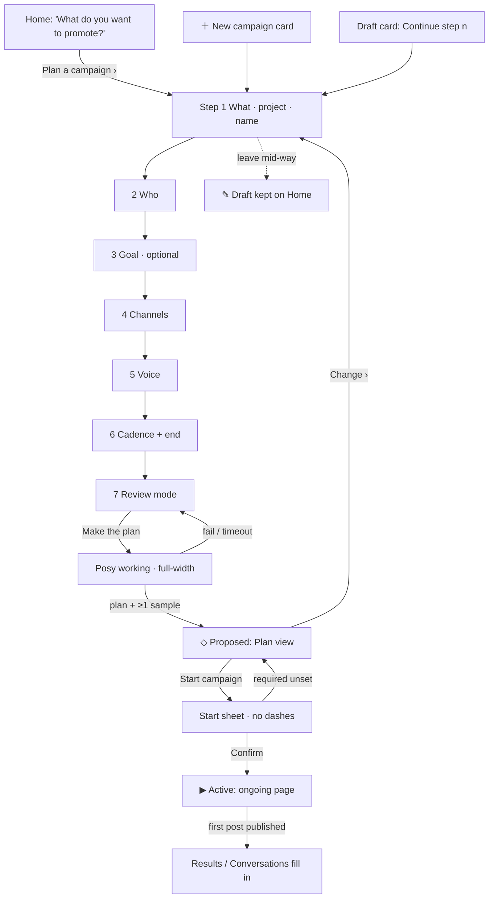

# The Desk v1 — UX pass (items 2, 4, 6)

**Status:** spec, 2026-09-28, Merrin (design lane). MC-977 / backlog 8f64d565. R0 is parked on this pass.
**Scope:** Ron's 2026-09-28 list, items **2** (project switching + obvious campaign creation), **4** (Posy-is-working
state) and **6** (first-run walkthrough vs ongoing campaign). Items **1, 3, 5** are Tilda's code fixes (modal size,
delete campaign, Posy input lost on tab switch). This doc references them and does not re-spec them.
**Authority:** amends `THE_DESK_V1_UI.md` §2, §3.4, §3.5. Where this doc and that one disagree, this doc wins for R0
and the UI doc gets a pointer (ticket U6). Behaviour/permissions still follow `THE_DESK_SPEC.md` and
`THE_DESK_SIMPLIFICATION_PLAN.md` §4 (approval bounds).

## 0. What the screenshots show (the defects, precisely)

| Screenshot | What's wrong | Root cause in code |
|---|---|---|
| `agent_4175e5c7c4.png` Home | `Clayrune ▾` looks like a switcher and does nothing; nothing says "start a campaign here" | `desk-v1-home.js:523` toast stub; promote box is only a placeholder sentence |
| `agent_6fce437ae7.png` new campaign | Goal `__ by __`, "No channels yet", empty Content, Posy's "reply" appears instantly and just echoes the text | `_createProposedCampaign` (`home.js:71`) creates an empty shell and navigates straight to the ongoing layout; `deskV1FillProposedSummary` (`rules.js:43`) renders labels with no values; Posy handler is synchronous |
| `agent_77f1e42ebf.png` Start sheet | Every row `—`; title is a suggestion chip's raw sentence | `deskV1OpenStartSheet` (`rules.js:180-187`) falls back to `'—'`; campaign name = raw promote text |

The common fault: **a campaign exists before it has anything in it.** Fixing 6 fixes most of 2 and all of the Start sheet.

## 1. Item 6: two modes, one graduation rule

### 1.1 States (no new vocabulary)
Uses the existing §9 campaign states. `✎ Draft` already exists in `DeskV1Kit.CAMPAIGN_STATES` ("manually started,
incomplete") and becomes the walkthrough's state.

| State | Layout shown | Enters when | Leaves when |
|---|---|---|---|
| `✎ Draft` | **Setup walkthrough** (new route `setup`) | user presses `Plan a campaign ›` on Home, or picks `＋ New campaign` | all required answers given AND Posy's plan returns ≥1 sample piece → `◇ Proposed` |
| `◇ Proposed` | **Plan view** (replaces today's empty summary bar) | graduation from Draft | `Start campaign` confirmed → `▶ Active`; or discarded (Tilda's item 3 delete) |
| `▶ Active` / `⏸ Paused` / `✓ Completed` | **Ongoing campaign page** (today's 12a layout) | Start confirmed | unchanged |

**Graduation rule, exactly:** a campaign may render the ongoing layout only in Active/Paused/Completed. A Draft never
renders a summary bar. A Proposed campaign renders the Plan view, never the tabbed page.

### 1.2 Setup walkthrough (Draft): screen by screen
Full-width route inside the Desk window, `‹ Home` back. One question per screen, `Step n of 7`, `‹ Back` · `Next ›`.
Every step shows Posy's suggestion **pre-filled**, marked `? Posy's guess` until the user touches it, so pressing Next
seven times always produces a valid plan. Progress saves on every Next; leaving mid-way keeps a Draft card on Home.

| # | Question (screen title) | Control | Required | Default / Posy's guess | Maps to bound (SIMPLIFICATION §4) |
|---|---|---|---|---|---|
| 1 | **What are you promoting?** | the promote-box text (carried over), `📎` file / `🔗` link, project picker `From: Clayrune ▾`, name field | text yes | name = Posy's short title, never the raw sentence; project = Home filter, else the single project | thesis, source scope |
| 2 | **Who is it for?** | 3 audience chips + free text | no | from the project's signals, e.g. "Windows users trying Claude Code" | (goal audience) |
| 3 | **What should happen?** | outcome chips (signups · installs · stars · visits · "just get it seen") + number + date | no | "Just get it seen", no number | goal; untracked = `⚠ not tracked yet`, not a blocker (CMP-03) |
| 4 | **Where should it go?** | connected channel badges (UX-02 identity + capability glyph); `✋ You publish it` destinations listed; `＋ Connect` | ≥1 | the project's connected channels | platforms / accounts |
| 5 | **Whose voice?** | per channel: `Ron (first person)` / `Clayrune (the product)`, each with a one-line sample | yes | X → Ron, LinkedIn → Clayrune (spec, decided 2026-09-09) | voice(s) |
| 6 | **How often, and until when?** | `Up to [3] a week` + ⓘ "a ceiling, not a quota"; ends `[30 days]` or `[12 posts]` | yes | 3/wk, 30 days / 12 posts | cadence ceiling, end date + cap |
| 7 | **How much do you want to check?** | two cards: `You approve each piece` · `Approve the plan, then Posy runs it` (with Pause always available) | yes | see open question Q2 | review mode |

Step 4 with **zero** connected channels: shows the manual route (Open in X / Copy, SIMPLIFICATION step 2b) as a real,
selectable destination with `✋ You publish it`, plus `＋ Connect`. The walkthrough never dead-ends on a missing API
connection.

**Finish:** `Next ›` on step 7 becomes `Make the plan`. The page switches to the **Posy working** state (§3, full-width
variant: "Posy is drafting your plan… reading Clayrune's recent changes"). On result → navigate to Plan view.
On failure → stays on step 7 with the failure copy from §3.3; answers are kept.

Visuals in samples: a real screenshot from the project (tools/smoke capture or user upload) or none. Posy never
generates imagery of the product (standing position, 2026-09-10).

### 1.3 Plan view (Proposed)
Replaces `deskV1FillProposedSummary` + `deskV1FillProposedContent`. A readable page, no tabs, no empty fields:

```
◇ Proposed   Windows beta testers                                   [Start campaign]
The plan, in one paragraph:
  Posy will post up to 3 a week on 𝕏 · @ron as Ron, for 30 days or 12 posts, whichever
  comes first, to reach Windows users trying Claude Code. Goal: 30 tester signups by
  Oct 20 (⚠ not tracked yet · How?). You approve each piece.            [Change ›]
Three sample posts                     (each: editable, `Ask Posy to redo`, `? Assumed` popovers)
Posy's one question (only if a real blocker exists, CMP-03)
[Posy box, scoped "About: the plan"]
```

- Every clause in the paragraph is a link back to its walkthrough step (`Change ›` opens step 1 with answers kept).
- An unset optional answer is **omitted from the sentence**, never rendered as a blank label. No goal → the sentence
  reads "Goal: none set · Add one". That is the rule for every surface in this pass: *no label without a value.*

### 1.4 Start sheet with unset fields
`deskV1OpenStartSheet` changes (CMP-05 content unchanged):
- **Title** = campaign name (Posy's short title), never the promote text.
- **Required bound unset** (accounts, voice, frequency, end): row reads `⚠ Not set · Set it ›` (jumps to that step);
  `Confirm — Start campaign` disabled with the reason under it: "Set 2 things first: accounts, end date."
  Via the walkthrough this state is unreachable; it guards Proposed campaigns created by drops (`home.js:126`).
- **Optional unset**: the default in words, never `—`: Replies `Drafted for your review (default)`, Paid `Off`,
  Generation limits `No video generation (default)`, Stop conditions `Ends at 30 days or 12 posts` (derived).
- Keeps "Starting doesn't approve any piece" only when review mode = each piece. Under plan approval the line becomes
  "Starting lets Posy publish within these limits. Pause stops it at any time." (per-campaign position, 2026-09-23).

### 1.5 Ongoing page: empty states once Active
Active but nothing published yet is still a thin page. Rules:
- Summary bar goal with no data: `Goal: 30 signups by Oct 20 · starts counting at the first post` (no `0/30` bar).
- **Results** tab before the first publish: "Results start after the first post goes out. Next: Tue 09:00 on 𝕏 · @ron."
  No zeroes (MET-01 already forbids unmeasured 0).
- **Conversations** before the first publish: "Replies show up here once a post is live." (never "no one is talking").

### 1.6 Flow



## 2. Item 2: projects and campaign creation

**Decision (recommended, Q1):** the Desk stays one place across projects (spec "one-place requirement"); a project is a
**filter**, not a context switch. Campaigns already carry `project_ids` (`desk_routes.py:322`, the source-scope bound).

- Header `Clayrune ▾` → `Projects: All ▾`, a checklist of Clayrune projects with ≥1 signal or campaign, plus "All".
  Persisted in `localStorage` (`desk_v1_project_filter`). Filters campaign cards, Needs you and suggestion chips.
- Each campaign card gets a project chip when the filter is "All" and >1 project is present.
- The walkthrough's step 1 `From:` defaults to the filtered project.
- R0: fixtures gain a second project (`engulfing_scanner`, 1 campaign) so the filter is exercisable.

**Making creation obvious** (no tour, no coach marks; the layout teaches it):
1. The promote box gets a title, **Start a campaign**, and helper text: "Tell Posy what you want to promote: a feature,
   a release, a link. She'll walk you through the rest." Button `Propose` → **`Plan a campaign ›`**. It opens step 1
   pre-filled; it no longer creates a campaign.
2. The campaign grid always ends with a dashed **`＋ New campaign`** card (opens step 1 empty).
3. **Zero campaigns** (first ever visit): Home shows only the promote box, centered at reading width, with 3 example
   chips ("The new Windows installer", "Restore points", "Paste a link to a release"). Needs you and shelves are hidden
   until there is something in them; Channels shelf shows only `＋ Connect a channel` if none exist.
4. Draft cards: `✎ Draft · step 4 of 7` with `Continue ›` and `Discard` (Tilda's item-3 delete path).

## 3. Item 4: Posy is working

### 3.1 States (every Posy box: campaign, plan, review, video director, walkthrough finish)

| State | What the box shows | Input |
|---|---|---|
| idle | suggestion + chips | enabled |
| sent | user's text as a bubble, then `.typing-indicator` (reused, `data-act` = thinking / writing / tool) | Send disabled, label `Posy is working…`; typing allowed, kept |
| working > 10s | adds a line: "Still working · 0:14" (elapsed, ticking) | same |
| working > 30s | "Taking longer than usual. You can leave this page; the answer will wait here." | same |
| done | before → after + affected items + Undo (existing INS-01..04 rendering) | enabled |
| failed | `⚠ Posy couldn't finish: <reason>. Nothing was changed.` · `Try again` · `Edit request` (puts the text back) | enabled |
| timed out (180s) | `⚠ Posy didn't answer in 3 minutes. Nothing was changed.` · `Try again` · `Keep waiting` | enabled |

- **Reuse, don't fork:** the dots/wave markup is `_actIndicatorInner` in `conversation.js:4436`. Expose it once as
  `window.actIndicatorHTML(kind)` and call it from the kit. (The UI doc's `CLAYRUNE_CONVERSATION_REDESIGN.md` does
  not exist; the real source is `docs/CONVERSATION_REDESIGN_ACTION_PLAN.md`, as the R0 plan already notes.)
- **Survives navigation:** in-flight state lives in a store keyed by `(campaignId, scope)`, not in the DOM. Returning to
  the page re-renders the dots. Home's campaign card shows `⟳ Posy working` while any ask for it is in flight. A result
  that lands while the user is elsewhere raises a toast "Posy finished: <campaign> · Open".
  **This is the same store as Tilda's item 5 (draft text survives tab switch).** One store in the kit, not two:
  `DeskV1Kit.posyState` = `{draftText, ask: {id, state, activity, startedAt, result, error}}`.
- One ask in flight per scope. A second Send on the same scope is disabled with "Posy is still on the last one."
- Nothing is applied until the result renders with Undo. A widening result still asks first (INS-03/04).

### 3.2 R0 (simulated)
Latency 1.5–4 s, activity `thinking` then `writing`. Test hooks: `window.__deskV1PosyForce = 'fail' | 'timeout' | 'slow'`
(slow = 35 s scripted clock, so the smoke never sleeps). Copy is final; only the transport is fake.

### 3.3 R1 contract (real Posy)

```
POST /api/desk/campaigns/<id>/ask   {text, scope:{kind, id}, client_req_id}
  202 {ask_id, session_id}            dispatches Posy (same path as dispatch_rework, desk_routes.py:466)
  409 {reason:'in_flight', ask_id}    one per scope; client re-attaches to ask_id
  4xx {reason}                        shown verbatim in the failed state
GET  /api/desk/asks/<ask_id>
  {state: queued|working|done|failed|timed_out, activity: thinking|writing|tool|'',
   started_at, result?: {before, after, affected[], widening, undo_token}, error?: {reason}}
```
- `client_req_id` makes Send idempotent across reconnects. Client polls every 2 s while visible (SSE later, optional).
- The server owns the 180 s timeout. A result arriving after `timed_out` is stored and shown as "Posy finished late ·
  Review", never auto-applied.
- `activity` comes from the session's existing `activity_state` (`--include-partial-messages`, shipped `5c70f37`).
- Agent-originated calls to `/ask` are fine (it only proposes); it can never apply a widening change (authority guard).

## 4. Files that change

| File | Change | Ticket |
|---|---|---|
| `static/js/desk-v1-kit.js` | `posyState` store; working/failed/timeout rendering in `posyBoxHTML`/`bindPosyBox`; async `onSend` | U1 |
| `static/js/conversation.js` | expose `window.actIndicatorHTML` (one line, no behaviour change) | U1 |
| `static/js/desk-v1-setup.js` (new) | walkthrough route, 7 steps, Draft persistence, finish → working → Plan view | U2 |
| `static/js/desk-v1-shell.js` | add `setup` route (parent `home`) | U2 |
| `static/js/desk-v1-rules.js` | Plan view replaces Proposed summary/content; Start sheet unset rows; async Posy handler | U3 |
| `static/js/desk-v1-campaign.js` | Active empty states (goal, Results, Conversations) | U4 |
| `static/js/desk-v1-home.js` | project filter, zero-campaign Home, `＋ New campaign` card, Draft cards, Propose → setup | U5 |
| `static/js/desk-v1-fixtures.js` | 2nd project, a Draft campaign, zero-campaign mode, Posy latency script | U1–U5 |
| `static/css/desk-v1.css` | walkthrough, plan view, working states | U1–U5 |
| `tools/smoke/desk-v1-*.mjs` | new `desk-v1-setup.mjs`; home/rules/campaign updated; exit sweep adds `setup` + `plan` routes | each ticket |
| `docs/THE_DESK_V1_UI.md` | pointers from §2/§3.4/§3.5 to this doc | U6 |

## 5. Tickets (one builder each, merge one at a time, smokes after each merge)

| # | Ticket | Depends on | Acceptance (verified by smoke, all 3 tones) |
|---|---|---|---|
| **U1** | Posy working state + shared `posyState` store | Tilda item 5 merged first, or U1 absorbs it (coordinate) | Send → dots within 100 ms; forced fail/timeout show exact §3.1 copy and restore text; navigate away and back mid-ask → dots still there; Home card shows `⟳ Posy working` |
| **U2** | Setup walkthrough + Draft state | U1 (finish uses working state) | 7× Next from Home with defaults reaches Plan view; leave at step 4 → Draft card → Continue lands on step 4 with answers; zero connected channels still completes via `✋` |
| **U3** | Plan view + Start sheet with no dashes | U2 | Plan view has 0 empty label/value pairs (DOM assertion); Start sheet contains no `—`; required-unset disables Confirm with reason; title = name |
| **U4** | Active empty states | U3 | fresh Active campaign: no `0/` progress, Results + Conversations show the §1.5 copy; lint A12 clean |
| **U5** | Home: project filter, first-run Home, New campaign card | U2, Tilda item 1 | filter hides the other project's cards/Needs you; zero-campaign fixture shows only the promote box + examples; `Plan a campaign ›` opens step 1 prefilled |
| **U6** | Exit gate re-run + UI doc pointers + greyscale shots for `setup`/`plan` | U1–U5 | `desk-v1-exit.mjs` exit 0, routes incl. setup/plan × 3 tones |
| R1-a | `/ask` backend per §3.3 (filed, not R0) | R1 start | tests: 202/409/idempotent replay, server timeout, late result not applied |

**Not verified yet, needs people:** the 5-user "under 5 minutes" test (`desk_v1_r0_exit.md`). This pass is designed
to make it passable; only running it proves that. Run it after U6.

## 6. Open questions for Ron (recommendation marked)

**Q1. Projects: filter or switch?** (a) One Desk, `Projects: All ▾` filter, campaigns tagged by project.
(b) Hard switch, one project's Desk at a time. **Recommend (a):** the spec's one-place requirement, and a
cross-project campaign (one voice, two projects) can't live under a hard switch.

**Q2. Default review mode for a user's FIRST campaign?** (a) `You approve each piece` for the first campaign only,
`Approve the plan, then Posy runs it` default from the second on. (b) Plan approval from the start, per the standing
position. **Recommend (a):** a non-expert should see what Posy writes before trusting the cadence. This does not
reopen the per-campaign position; plan approval stays available and becomes the default once one campaign has run.

**Q3. Walkthrough form: stepped cards or a chat with Posy?** (a) Stepped cards, one question each, Posy's guess
pre-filled. (b) Posy asks in the chat, user answers in free text. **Recommend (a):** faster, Back works, defaults are
visible, and it's scriptable for the smoke; Posy's personality shows in the guesses and the plan paragraph instead.
