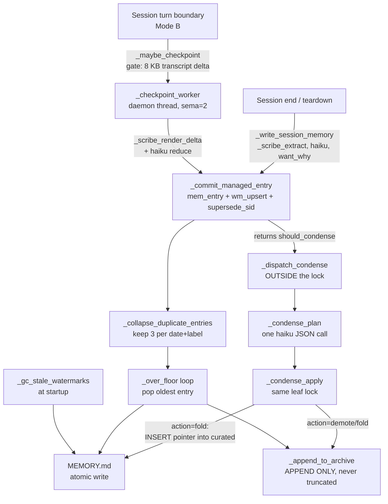

# Seat 2 — E2E audit: the WRITE path, index lifecycle and growth dynamics

Backlog item `dae8d6e7`. Hivemind `hm_ea8bd971`, workstream `ws_002`.
All measurements taken on this machine, **2026-08-15**, by this seat, unless
explicitly labelled *(journal)* or *(estimate)*. Analysis only — no production
code, `MEMORY.md`, or memory-dir edits. Probes live in `_scratch/`.

---

## 0. Executive summary — what I found that changes the design

Seven findings. Four of them invert or materially move the framing in the
backlog item.

| # | Finding | Confidence |
|---|---|---|
| **F1** | `read_floor_topk` is **3** live, not the 6 that shipped 2026-08-05. `config.json` shadows the code default. The shipped fix has never been in effect. | high |
| **F2** | Turning it on is worth **31 dark files → 11** (measured, 159 tasks). The "30 dark files are the real retrieval defect" is 65% a config line. | high |
| **F3** | Condense is not merely *forbidden to shrink* curated — `fold` is an **insert-only pump that grows it**. 117 fold operations against a 96-pointer region. Curated growth is machine-driven. | high |
| **F4** | Structured condense **cannot fire**. The byte floor (23,552) and the condense trigger (>24,576) leave a 1,024-byte deadband the file can never occupy. Zero `[condense]` log lines in 2+ days while dedup and wm-GC fire freely. | high |
| **F5** | `scribe_fell_back:parse_empty` is **diagnosed and is not a defect** — it is a correctly-classified trivial session, wearing a name that reads like a parser bug. 56/242 transcripts reproduce it. Two small real gaps inside it. | high |
| **F6** | Watermark markers cost **660 bytes each** of the always-loaded index — 5.4% of the budget for 2, 11% for a 4-worker hivemind — and they carry zero agent-facing value. They exist inside `MEMORY.md` partly *because* of the DATA_DIR rule. | high |
| **F7** | The real ceiling is **not** "curated crosses the budget" (≈2027-04-12). It is "curated + watermarks squeeze the managed region to zero," which at the measured rate is **≈2027-02-24**, and **≈2027-01-08** if hiveminds are routine. | medium |

The 2026-08-05 dedup fix **holds and has not re-leaked** (verified, §4).
`MEMORY_ARCHIVE.md` **is being read** — 15–20% of all read-floor slots (§6).

---

## 1. Method and ground truth

### 1.1 Measurement discipline

The journal records three retracted confident claims on this item. Every number
below states its method. Two traps I hit and worked around, recorded so nobody
re-derives them:

- **`mc.memory` must be wired before use.** `_get_memory_path` resolves through
  `_native_memory_path`, which needs the module's late-bound path constants. A
  probe that imports `mc.memory` directly and stubs `state.CONFIG` returns
  **zero hits for every query** and looks like total retrieval failure. It is
  not — it is an unwired module. `tools/memory-eval/scorer_ab.py` does
  `importlib.import_module("server")` first, and so must anything else.
- **Byte counts differ by ~1 byte/line on Windows.** `MEMORY.md` on disk is
  **23,277 bytes** (CRLF). Read with `read_text()` (universal newlines) and
  re-encoded it is **23,143 bytes**. `_over_floor` uses the *decoded* form, so
  **the floor under-counts the real file by exactly its line count** (134 bytes
  today). Journal datapoints do not state which method they used, which pollutes
  the recorded trend by up to ~134 bytes. **All figures in this document are the
  decoded/LF form** — the same one the machinery uses — unless marked "on disk".

### 1.2 Corpus as it stands today

```
memory dir: ~/.claude/projects/<encoded-project-dir>/memory/
76 files, 1,109,395 bytes (1,083.4 KB)
  MEMORY_ARCHIVE.md   792,838 B  (71.5%)
  MEMORY.md            23,277 B on disk / 23,143 B decoded
  74 topic files      293,280 B  (median 3.2 KB, max 20.3 KB)
```

`MEMORY.md` decomposed (measured):

```
TOTAL            23,143 B   134 lines
  CURATED        16,820 B   113 lines   72.7%   96 pointer lines (16,023 B)
                                                 59 carry a .md link / wikilink
                                                 37 do not (the line IS the fact)
  MANAGED block   6,260 B                27.0%
    entries       4,924 B   15 entries   avg 328 B
    wm markers    1,320 B    2 markers   avg 660 B
```

Live config (`GET /api/config`), the numbers that actually govern:

```
index_byte_budget      24576      -> _index_byte_cap()   = 24,576
                                     _index_byte_floor() = 23,552
index_line_budget        160
index_line_hard_floor    185
condense_mode       structured
condense_enabled          true
scribe_enabled            true
scribe_checkpoint_enabled true      scribe_checkpoint_kb = 8
read_floor_topk              3      <-- see F1
read_floor_link_expand       2
```

---

## 2. The write path, end to end

There are exactly **four** writers to `MEMORY.md`, all sharing one per-project
leaf lock (`_get_mem_write_lock`) and one atomic primitive
(`_atomic_write_text`). That part of the design is sound and I found no crack in
it.



**Load-bearing / dead / silently failing:**

| Component | Verdict | Evidence |
|---|---|---|
| `_commit_managed_entry` (leaf lock + atomic + floor) | **load-bearing, healthy** | all four writers route through it |
| `_collapse_duplicate_entries` | **load-bearing, firing** | 49 `[mem-dedup]` log lines; no group over keep=3 (§4) |
| `_gc_stale_watermarks` | **load-bearing, firing** | 17 `[wm-gc]` log lines |
| Scribe terminal path | **healthy** | 476 `scribe_extracted` lifetime |
| Step-6 checkpointing | **healthy, dominant** | 1,844 `checkpoint_extracted`; 101 `entry_superseded` |
| **Structured condense** | **SILENTLY FAILING — cannot fire** | 0 `[condense]` lines in the current 50 MB log (§5) |
| **`read_floor_topk` = 6** | **SILENTLY INERT** | shadowed by `config.json` (§7) |
| `_append_to_archive` | **append-only by design; never removes** | code + 288 exact duplicate lines (§6) |

---

## 3. The Scribe, and the `scribe_fell_back:parse_empty` diagnosis

### 3.1 Live telemetry

`GET /api/project/mission_control/scribe-stats`, 2026-08-15T21:59:06Z:

```
scribe_extracted                476     checkpoint_extracted            1844
scribe_fell_back:parse_empty     80     checkpoint_skipped:parse_empty    13
scribe_fell_back:model_error     38     checkpoint_skipped:model_error    53
scribe_fell_back:no_transcript   13     checkpoint_skipped:model_refused  28
scribe_fell_back:model_refused    9     checkpoint_coalesced              14
entry_superseded                101     checkpoint_offset_reset            2
counters_last:
  scribe_fell_back:parse_empty  2026-08-15T21:57:15Z   <-- bumped ~2 min before I read it
```

Terminal-path attempts = 476+80+38+13+9 = **616**. `parse_empty` is **80/616 =
13.0%** (the brief's 66/429 = 15.4% has decayed slightly). `counters_last` shows
it is **still bleeding today**, not a historical backlog — that field exists
precisely because this ambiguity caused a live misdiagnosis on 2026-08-05.

### 3.2 Diagnosis — DIAGNOSED, and it is not a bug

Probe: `_scratch/ws2_parse_empty_probe.py`. Replays `_scribe_render_lines`
verbatim plus the `_scribe_summarize_text` thin guard over **all 242 transcripts**
(351 MB) for this project. Read-only.

```
transcripts scanned      242
  ok                     186   (77%)
  assistant_only_short    52   (21%)   <-- parse_empty
  empty_render             4   ( 2%)   <-- parse_empty
```

**56/242 = 23% reproduce parse_empty**, consistent with the 13% lifetime counter
(the counter only fires when a session reaches the terminal scribe).

There are two code sites that emit this reason, and **the one everybody assumed
is not the one firing**:

```python
# mc/memory.py:1754  — a genuine parse failure. Requires _scribe_render_transcript
# to RAISE. It opens with errors='replace', so only an OSError gets here. RARE.
try:    transcript = _scribe_render_transcript(tf)
except Exception:   return None, 'parse_empty'

# mc/memory.py:1806  — THE ONE THAT FIRES. A content judgement, not a parse.
_has_activity = any(ln.startswith(('ACTION ','RESULT:','THINKING:'))
                    for ln in _stripped.splitlines())
if not _has_activity and len(_stripped) < 120:
    return None, 'parse_empty'
```

**The surprising part, and why it stayed undiagnosed for 10 days:** these
transcripts are **40–62 KB on disk** and render to **13–63 characters**. That
looks exactly like a parser eating the file. It is not. Structural dump of three
of them:

```
93b5beb3….jsonl   46,024 B, 12 lines
   attachment / no message dict        n=6   43,497 B   (94.5% of the file)
   queue-operation / no message dict   n=2      291 B
   last-prompt / no message dict       n=2      282 B
   user / content is a STRING          n=1      510 B
   assistant / list[text]              n=1    1,256 B   -> "ASSISTANT: ok" = 13 chars
```

Across all 56 candidates, **90% of their raw bytes are `type:"attachment"`
lines** (2,072,927 of 2,300,891) — the CLI's record of the injected context
(CLAUDE.md, MEMORY.md, the read floor). They carry no `message` dict and
`_scribe_render_lines` skips them, **correctly**. The actual conversation in
these files is one user turn and one or two short assistant turns.

**Verdict: `parse_empty` means "the agent did no tool calls, no visible
reasoning, and replied with under 120 characters."** That is a real trivial
session. The classifier is right; the *name* is wrong, and the wrong name cost
this project a tracked, undiagnosed error class. The median discarded user text
in these sessions is **2 characters** — the user genuinely typed "ok". This is
the same population `scorer_ab.py` already excludes via `MIN_TASK_CHARS`, and
the same population that produces `- [2026-08-12] **ok** _(interrupted)_ — ok`
in the session log.

### 3.3 Two real gaps found inside it (small, worth recording)

**Gap A — redacted thinking blocks are invisible to the activity test.**
Encrypted thinking arrives as:

```json
{"type":"thinking","thinking":"","signature":"<952 bytes of base64>"}
```

`_scribe_render_lines` reads `b.get('thinking') or b.get('text')` → both empty →
the block is dropped and **does not set `_has_activity`**. Measured in
`747c1f17…`: a 2,253-byte thinking block rendered to nothing. So a session where
the model demonstrably reasoned still classifies parse_empty if its text reply is
short. Impact is bounded — such sessions had no tool calls anyway — but the
`signature` field is a reliable presence signal that is currently thrown away.

**Gap B — the user's message is never rendered, so an early death loses the ask.**
`_scribe_render_lines` only emits assistant-side blocks; `user` messages arrive
with `content` as a **string**, which fails the `isinstance(msg['content'], list)`
gate. For the 4 `empty_render` cases the agent never replied at all, so the
transcript's only content *is* the user's message — and it is discarded. Measured:
**8 of 56 candidates carry a discarded user message of ≥200 characters, the
largest 7,817 characters.** The fallback then writes `ended with status=…, no
captured output` when a full task description sat on disk unread.

Neither gap is the cause of the 13%. Both are cheap to close and I am recording
them rather than proposing them, per the analysis-only scope.

### 3.4 Downstream cost of the trivial-session population

These sessions still get a managed entry, from the fallback path:

- **`MEMORY.md` today: 5 junk entries, 663 bytes** (13% of the managed region's
  4,924 B) reading `**ok** _(interrupted)_ — ok` at 44 bytes each.
- **`MEMORY_ARCHIVE.md`: 77 of 2,476 entry lines (3%), 9,128 bytes.**

Small in bytes, but each junk entry occupies one of only ~16 managed slots (§8),
and each is a retrieval unit that can never match anything useful.

### 3.5 A boilerplate-label leak the 2026-08-05 fix does not cover

`_entry_label` collapses exactly one harness marker:

```python
_STEWARD_TASK_MARKER = '[Steward cycle]'
if _STEWARD_TASK_MARKER in t[:60]:  return _STEWARD_LABEL
return t[:80]
```

Today's managed region contains **three** entries titled
`**[the user is messaging you from a phone — reply in Telegram style: short, conver**`
— 80 characters of harness preamble carrying zero information about what the
session did. This is the *identical* defect the steward marker fixed, with a
different marker, and the allowlist-of-one design guarantees it recurs for every
new harness prefix. It also corrupts `_entry_group_key`, so genuinely different
phone sessions group together and dedup treats them as duplicates of each other.

---

## 4. Step-6 checkpointing, supersede, and the 2026-08-05 dedup fix

### 4.1 The fix holds. Verified, not assumed.

Grouping today's 15 managed entries by `(date, normalized label)` — the exact key
`_entry_group_key` computes:

```
3  ('2026-08-15', '[the user is messaging you from a phone …')
3  ('2026-08-15', 'the new chat button does not show the opt…')
2  ('2026-08-12', 'ok')
2  ('2026-08-14', 'the new chat button does not show the opt…')
2  ('2026-08-14', 'ok')
1  ('2026-08-13', 'I need ur help with stopping all schedule…')
1  ('2026-08-13', 'Steward cycle')
1  ('2026-08-13', 'ok')
```

**No group exceeds `_MANAGED_DUP_KEEP = 3`.** Two sit exactly at the cap, which
is the collapse doing its job rather than a near-miss. Corroborated by
**49 `[mem-dedup]` lines** in the current log and **`entry_superseded: 101`** in
telemetry. The 2026-08-05 pile-up (16 entries, all one steward session) has not
re-formed. **No re-leak.**

### 4.2 Ordering is the load-bearing part, and it is still correct

`_commit_managed_entry` runs collapse **before** the oldest-first floor
(memory.py:1082 then 1087). That ordering *is* the fix: the floor is blind to
repetition, so with the order reversed a same-day burst evicts unrelated
multi-day history to make room for near-duplicates. Anything that touches this
function must preserve the order.

### 4.3 Residual: `keep=3` is per `(date, label)`, so a busy day still costs

Three distinct labels on one day = up to 9 entries surviving collapse, against a
managed capacity of ~16 (§8). Today's 15 entries span 4 days. **The session-log
horizon is ~3 days.** Not a defect, but it is the actual retention the design
should be reasoned about — the front page does not hold "recent history," it
holds roughly this week.

### 4.4 Supersede is correct but depends on a watermark surviving

`supersede_sid` finds the previous entry via `last_entry_hash` stashed on the
session's **watermark record**. `_gc_stale_watermarks` prunes markers for
sessions absent from `agent_sessions`. If a session is GC'd and then revived
(the reconciler backfills from `agent_log`), its `last_entry_hash` is gone and
its next checkpoint **cannot supersede** — it appends alongside. The collapse
then catches it at keep=3 rather than 1. Degradation is graceful and bounded, and
the GC explicitly re-tests liveness inside the lock, so I found no live leak. I
flag it only because it is the one path where supersede silently weakens.

---

## 5. Curated vs managed, and why condense cannot shrink curated

### 5.1 The prohibition is explicit and one-directional

```python
# _validate_condense_payload, memory.py:2006
if payload.get('curated_rewrite') is not None:
    return False, 'curated_rewrite_forbidden_v1'
```

Any payload that so much as mentions rewriting curated is rejected **pre-write**,
so `MEMORY.md` is untouched. There is no mechanical path — none — by which
machinery removes a curated line. `_over_floor`, `_collapse_duplicate_entries`,
`_gc_stale_watermarks` and the floor loop all operate on `mem_entries` and
`wm_markers` only; `curated` is passed through `_mem_compose` verbatim.

The `_should_condense` escape hatch is a **log line, not an action**
(memory.py:848–857): when the file is over the byte cap with zero managed
entries, it emits *"Curated region needs human curation (overflow to
MEMORY_ARCHIVE.md); structured condense cannot act"* once per server run, and
returns False.

### 5.2 F3 — the inversion: `fold` is an insert-only pump INTO curated

The item frames curated growth as human-authored. That is half the picture. From
`_condense_apply`, memory.py:2155–2171:

```python
elif act == 'fold':
    hits = [k for k, ln in enumerate(cur_lines) if ln.strip() == heading]
    if len(hits) != 1:
        overflow.append(e); st['fold_downgraded'] += 1; continue
    if pl and pl not in cur_norm:
        cur_lines.insert(hits[0] + 1, pl)     # <-- WRITES INTO CURATED
        cur_norm.add(pl)
    overflow.append(e)                         # entry itself -> archive
    st['folded'] += 1
```

The code states the consequence itself at memory.py:2185: *"additive-only fold
has no mechanical eviction path until v2."*

**Measured, this project, lifetime:**

```
condense_entries_folded    117      <- insert attempts into curated
condense_entries_demoted   252
condense_entries_kept       40
condense_structured_ok      46
condense_noop              270
```

**117 machine fold operations against a region that today holds 96 pointer
lines.** (Some folds deduped on the `pl not in cur_norm` check; some inserted
lines were later removed by a human. I cannot attribute individual lines to
author, so I state the operation count, not a percentage — labelling that
distinction rather than guessing it.)

**Why this matters for the design:** curated has two writers — a human, and an
automated insert-only pump — and **only the human can remove**. The O(topics)
growth in the item's root cause is not merely a consequence of humans adding
notes; the system is actively pumping into a region it has forbidden itself to
drain. Any redesign that keeps a resident curated region must give it a
mechanical eviction path, or it reproduces this exact defect with new labels.

### 5.3 F4 — structured condense cannot fire at all

`_should_condense` in structured mode (memory.py:819–834):

```
over_lines = n_lines > index_line_budget(160)      ->  134 lines   FALSE
over_bytes = utf8_bytes > _index_byte_cap(24576)   ->  23,143 B    FALSE
```

Returns `False`. Corroborated: **zero `[condense]` lines** in the current 50 MB
`data/logs/clayrune.log` (window ≈2026-08-13 → 2026-08-15), against 49
`[mem-dedup]` and 17 `[wm-gc]` in the same window. The other subsystems are
demonstrably firing. Condense is not.

**This is structural, not a coincidence.** `_over_floor` evicts whenever bytes >
`_index_byte_floor()` = cap − 1024 = **23,552**, and it runs inside
`_commit_managed_entry` on *every* managed write. After any managed write the
file is pinned at ≤ 23,552. The condense trigger needs > **24,576**.

> **The 1,024-byte band between the floor and the cap is unreachable by
> construction.** The floor is defined as `cap − 1024` and the trigger as
> `> cap`, so the floor's own job is to keep the trigger from ever firing.

The only way `over_bytes` can become true is if **curated alone** exceeds
24,576 — and at that point the `if not entries` branch fires the "needs human
curation" log and returns False anyway. Meanwhile the floor keeps entry count
low enough (15 entries, 134 lines) that the *line* trigger at 160 is also
suppressed.

Net effect: **the system silently degraded from "trim → condense → escalate to a
human" to "trim forever."** The escalation tier that was supposed to catch
exactly this item's failure mode has been disabled by its own backstop.

For the migration plan: floor and trigger must not be derived from one constant
with the trigger on the far side of the floor. Either the trigger keys on
**curated** bytes — which the floor provably cannot touch — or the floor sits
above the trigger.

---

## 6. `MEMORY_ARCHIVE.md` — growth, removal, and whether it is read

### 6.1 Is anything ever removed? No.

`_append_to_archive` is the sole writer, read-modify-write under the caller's
leaf lock, docstring: *"the archive is append-only cold storage — never
truncated (SPEC D3)."* No code path shrinks it. Growth is monotonic, forever.

Measured today: **792,838 bytes on disk / 790,896 decoded**, 2,518 lines, **2,476
`- [` entry lines**, dates 2026-05-16 → 2026-08-15 across 89 distinct days,
mean 316 B/entry.

**288 exact-duplicate lines (11.6% of entries, 21,737 bytes)** — a line can be
appended more than once (re-demotion after a restore, reconciler re-scribing),
and nothing ever dedupes it. This is waste, not data loss.

### 6.2 Is it read? Yes — it is the largest live index we have.

`_mem_corpus` (memory.py:568) splits the archive into **one scoring unit per
`- [` line**. So of 2,565 total retrieval units, **2,476 (96.5%) are archive
lines**, 74 topic files, 15 managed entries.

Measured (`_scratch/ws2_class_share.py`, live `_memory_search`, 159 real
dispatched tasks ≥25 chars):

| topk | total slots | topic | archive | managed |
|---|---|---|---|---|
| 3 (**live**) | 477 | 379 (79%) | **97 (20%)** | 1 (0%) |
| 6 (shipped default) | 954 | 807 (84%) | **146 (15%)** | 1 (0%) |

**The archive takes a fifth of the read floor.** It is not cold storage. The
2026-08-05 result that 33 of 37 link-less curated pointer lines are recoverable
from archive units depends entirely on this indexing choice — and so does any
proposal to move curated lines "down" into the archive.

### 6.3 Archive growth rate

```
2026-08-09 11:42   776,690 B   (_scratch/memory_backup_2026-08-09/, measured)
2026-08-15 21:59   792,838 B   (measured)
                 = +16,148 B over 6 days = 2,691 B/day
                 ≈ 8.5 new retrieval units/day
```

Reaches 1 MB in ≈95 days (≈2026-11-18). Nothing breaks at 1 MB. The consequence
is **retrieval drift, not a size problem**: every appended line shifts the
`archive` class's `avgdl` in `_mem_class_avgdl` and the global IDF, so BM25
scores are not stable over time. That is a reason to make recall *continuously
evaluated* rather than measured by hand — flagging it to Seat 3 rather than
solving it here.

Caveat on a tempting wrong measurement: summing entry bytes **by the date in the
entry** gives ~914 B/day for 2026-08-11→08-15, which contradicts the 2,691 B/day
file delta. Both are right; they measure different things. The date in an entry
is the **session** date, not the **archival** date, and re-archived older entries
land in the recent window. **The file-size delta is the authoritative append
rate.**

---

## 7. Watermark GC, and the hidden per-session index tax

### 7.1 GC works

`_gc_stale_watermarks` runs at startup, prunes markers whose `session_id` is
absent from `agent_sessions`, re-tests liveness **inside** the lock so a
concurrently-revived session cannot lose its marker. **17 `[wm-gc]` lines** in
the current log confirm it fires. The 2026-07-11 incident (67 leaked markers,
37.8 KB, which truncated this index) has not recurred: **2 markers today, both
live.**

### 7.2 F6 — but each marker costs 660 bytes of always-loaded index

Measured, today's two markers: **650 B and 668 B**, 1,320 B total.

```
keys: session_id, claude_session_id, transcript_path, byte_offset,
      slice_hash, running_summary, last_entry_hash
running_summary: 249 and 300 chars   (_MEM_WM_SUMMARY_CAP = 600)
transcript_path: 153 and 123 chars   (absolute Windows path, verbatim)
```

| live sessions | wm bytes | share of the 24,576 budget |
|---|---|---|
| 1 | 660 | 2.7% |
| 2 (today) | 1,320 | **5.4%** |
| 4 (a hivemind — i.e. right now) | 2,640 | **10.7%** |

This is **pure machinery state**, of no use to any agent reading `MEMORY.md`,
sitting inside the file whose whole problem is that it is auto-loaded into every
prompt. And it is not merely a token cost: **wm markers count toward
`_over_floor`**, so every 660 bytes of watermark directly evicts ~2 real managed
entries to the archive. The floor comment says markers "never popped but DO
count toward the budget" — that is the mechanism by which a hivemind shortens
this project's visible session log.

Note the coupling to §9: this state is *in* `MEMORY.md` in part because
`DATA_DIR` is closed to new per-session JSON files.

---

## 8. MEASURED growth model

### 8.1 Datapoints (all measured by this seat except where marked)

| when | source | total | curated | ptrs | entries | wm |
|---|---|---|---|---|---|---|
| 2026-07-31 12:31 | `_scratch/mem_plain.md` snapshot | 23,517 | 19,505 | 105 | 12 | 2 (1,284 B) |
| 2026-08-06 | *(journal, method unstated)* | 20,656 | — | — | — | — |
| 2026-08-07 | *(journal)* | 22,924 | ~16,800 | — | — | — |
| 2026-08-09 11:42 | `_scratch/memory_backup_2026-08-09/` | 22,048 | **16,652** | 95 | 19 | 0 |
| 2026-08-15 18:41Z | *(journal)* | 23,547 | 16,854 | — | — | — |
| **2026-08-15 21:59Z** | **this seat** | **23,143** | **16,820** | **96** | **15** | **2 (1,320 B)** |

The two on-disk snapshots are the valuable find: they let me measure curated
growth directly instead of differencing journal entries of unknown method.

### 8.2 Curated growth rate

The 07-31 → 08-09 span crosses a **human curation event** (−2,853 B, −10
pointers; commit `ec445af`, "2 project indexes hand-curated"), so it is not a
growth rate. The clean, unmanaged window is:

```
2026-08-09  16,652 B, 95 pointers
2026-08-15  16,820 B, 96 pointers
          = +168 B, +1 pointer over 6 days
          = 28.0 B/day, 0.167 pointers/day, 168 B per pointer
```

Cross-checks against the journal's 2026-08-05 figures: 33.4 B/day (vs 16.1 KB)
and 23.1 B/day (vs 16.2 KB) over 10 days. Same-day method noise between my
16,820 and the journal's 16,854 is 34 B (±5.7 B/day over 6 days).

> **Adopted rate: 28 B/day central, 23–34 B/day range.**

**Managed** does not have a growth rate: it is *pinned* by the floor at
`23,552 − curated − wm`. **Archive** grows at 2,691 B/day (§6.3) — ~96× the
curated rate, which is the front-page-to-archive ratio widening, exactly as the
item predicted.

### 8.3 Projection — when does curated ALONE cross the budget?

Linear at 28 B/day from today's 16,820 B:

| target | central (28) | range (34 → 23) |
|---|---|---|
| eviction floor **23,552** | 240 days → **2027-04-12** | 198 d (2027-03-01) → 293 d (2027-06-03) |
| budget **24,576** | 277 days → **2027-05-19** | 228 d (2027-03-31) → 337 d (2027-07-18) |

Equivalently: **38 more pointer lines** (96 → 134) at 168 B each.

### 8.4 F7 — but that is the wrong ceiling. The real one is 5 months earlier.

Nothing bad happens the day curated crosses the budget; it is a token cost, per
the 2026-08-05 correction. The **operationally significant** date is when
curated + watermarks squeeze the managed region to **zero** — the day the front
page stops carrying any session log at all:

```
managed capacity = floor − curated − wm
today            = 23,552 − 16,820 − 1,320 = 5,412 B ≈ 16 entries (at 328 B avg)
actual           = 15 entries / 4,924 B          -> the region is already FULL
```

| live sessions | curated at which managed → 0 | central (28 B/d) | range |
|---|---|---|---|
| 1 | 22,892 | 217 d → **2027-03-19** | 179–264 d |
| 2 (today) | 22,232 | 193 d → **2027-02-24** | 159–235 d |
| 4 (hivemind routine) | 20,912 | 146 d → **2027-01-08** | 120–178 d |

**The session log's horizon is ~3 days today and shrinks monotonically at
~0.09 entries/day of lost capacity.** It reaches zero around **2027-02-24**,
five to seven weeks *before* curated crosses the eviction floor and nearly three
months before it crosses the budget.

### 8.5 Honest caveats on the projection

1. **The empirical record is sawtooth, not monotonic.** Curated dropped 2,853 B
   between 07-31 and 08-09 via human curation. The projection assumes that does
   not happen again — which is precisely the assumption the item exists to test.
   A human curation pass is a working (if unscalable) control, and any claim that
   the ceiling is inevitable must say "absent human curation."
2. **The clean window is 6 days and 168 bytes of signal.** The two independent
   cross-checks agree, but this is a small-sample linear fit. **Estimate, not a
   measurement, beyond ~90 days.**
3. **Growth may not be linear.** Curated is O(topics) and topics accrue with
   project age and surface count; §5.2 shows an automated pump feeding it. If
   anything, 28 B/day is a floor.
4. `condense_noop: 270` shows the trigger fired 270 times historically with zero
   entries, so past behaviour is not a clean guide to future rate either.

---

## 9. Where a new state file may live — the DATA_DIR and sidecar constraints

Any redesign that needs new persistent state (access counters, bitemporal
validity, an eviction ledger, a residency score) hits a hard, load-bearing rule.

### 9.1 The rule, verbatim from code

`mc/blueprints/project_routes.py:164`:

```python
def load_projects():
    for f in DATA_DIR.glob('*.json'):
        if f.name.endswith(EXCLUDED_SIDECAR_SUFFIXES):
            continue
        p = json.loads(f.read_text(encoding='utf-8'))
        ...
```

`EXCLUDED_SIDECAR_SUFFIXES` (project_routes.py:150):

```python
('_agent_log.json', '_scribe_stats.json', '_router_stats.json',
 '_skill_stats.json', '_skill_stats_summary.json',
 '_topics.json', '_topic_state.json')
```

**Every `*.json` in `data/projects/` that is not suffix-excluded is loaded as a
project.** A stray file becomes a malformed project record and 500s
`_get_active_restart_blockers`, which takes down **both** restart endpoints.
CLAUDE.md marks this LOAD-BEARING; there is a parametric regression test at
`tests/test_load_projects_sidecar_exclusions.py` with a next-sidecar canary.

### 9.2 What this permits, in order of preference

| option | safe? | notes |
|---|---|---|
| **Outside `DATA_DIR` entirely** | ✅ **preferred** | CLAUDE.md: *"New per-session/sidecar state belongs OUTSIDE `DATA_DIR`."* No test to satisfy, no coupling to restart health. |
| Non-`.json` extension inside `DATA_DIR` | ✅ | The glob is `*.json`. This is the documented escape used by `*_skill_stats_archive.jsonl`, and the exclusion test *enforces that every listed suffix is glob-matchable*, so a `.jsonl`/`.md` file must **not** be added to the tuple. |
| New `_*.json` suffix inside `DATA_DIR` | ⚠️ only with the tuple edit | Must be added to `EXCLUDED_SIDECAR_SUFFIXES` **in the same commit**, or restart breaks. Costs a canary-test update. |
| In the memory dir alongside `MEMORY.md` | ⚠️ **beware** | `_mem_corpus` globs `mem_dir.glob('*.md')`. Any new **`.md`** there becomes a retrieval unit and pollutes BM25 IDF/avgdl. A non-`.md` extension is fine. |
| Inside `MEMORY.md` (the wm-marker precedent) | ❌ | Costs 660 B/record of always-loaded index and directly evicts real entries via `_over_floor` (§7.2). Do not extend this pattern. |

### 9.3 Recommendation to Seat 3 / Seat 4

New memory state should go **outside `DATA_DIR`** — the memory dir with a
non-`.md` extension (e.g. `_index_state.jsonl`) satisfies both constraints at
once, keeps the state next to the data it describes, and needs no change to the
load-bearing tuple. Anything inside `MEMORY.md` is a per-prompt tax on every
session forever, which is the problem this item exists to remove.

---

## 10. `docs/MEMORY_SYSTEM.md` — verified against code, two drifts

The map is broadly accurate on the write path. Two corrections:

1. **Line 118: `read_floor_topk | 6 | deterministic read-floor snippet count`.**
   Documents the *intent*. Live value is **3** (§F1). The doc is right about what
   shipped and wrong about what runs.
2. **Line 198: *"only the Leg C condense model may rewrite it."*** Accurate about
   *who*, misleading about *what*. `curated_rewrite` is rejected outright; the
   model can only **insert** a pointer line via `fold`. "Rewrite" implies a
   bidirectional edit the code forbids, and it obscures the fact that the only
   automated curated writer is monotonically additive (§5.2).

Everything else I checked — the four-writer set, the leaf-lock/atomic contract,
the Step-6 fold-in contract, the archive-is-permanent invariant, the DATA_DIR
warning — matches the code as it runs today.

---

## 11. Handoff: what Seats 3 and 4 should take from this

1. **Stage 0 of any migration is `read_floor_topk: 3 → 6` in `config.json`,** and
   every later stage must be measured against that baseline, not against today's.
   It moves the dark set 31 → 11 for one line (§F2). Do not design structure to
   solve a problem two thirds of which is a config value.
2. **A code default is not a shipped change on an install that persists the key.**
   `config.json` shadows `server.py` defaults. Every stage that changes a default
   must patch `config.json` and verify via `GET /api/config`.
3. **Curated needs a mechanical eviction path, not just permission to be
   hand-edited.** It has an automated insert-only writer and no automated
   remover (§F3). This is a stronger argument for the redesign than the item's
   own.
4. **Do not define the eviction floor as `trigger − k`.** That is how the
   escalation tier got disabled (§F4). Key the trigger on curated bytes, which
   the floor cannot touch.
5. **Budget for watermarks explicitly.** 660 B per live session inside the
   always-loaded index, and they evict real entries. A hivemind costs ~11% of the
   index budget (§F6).
6. **The archive is a live index, not cold storage** — 15–20% of read-floor
   slots, 96.5% of retrieval units (§6.2). Any proposal to "demote to the
   archive" is a *retrieval* change, not an archival one, and its effect on BM25
   class statistics must be measured.
7. **The real deadline is ~2027-02-24 (managed → 0), not ~2027-05-19 (curated >
   budget)** — and ~2027-01-08 if hiveminds become routine (§F7).
8. **`parse_empty` is diagnosed and closed** (§3): a correctly-classified trivial
   session with a misleading name. Two small real gaps recorded (redacted
   thinking blocks; discarded user text on early death). It is not a blocker for
   anything in this redesign.

---

## Appendix — probes written for this audit (all read-only, `_scratch/`)

| file | what it does |
|---|---|
| `_scratch/ws2_parse_empty_probe.py` | Replays `_scribe_render_lines` + the thin guard over all 242 transcripts; classifies `ok` / `assistant_only_short` / `empty_render`. |
| `_scratch/ws2_parse_empty_rows.json` | Per-transcript output of the above (raw bytes, rendered chars, class). |
| `_scratch/ws2_class_share.py` | Wires `server`, replays live `_memory_search` over 159 real dispatched tasks at topk 3 and 6; reports unit-class slot share and the dark set. |

Reproduce the index split, growth model and archive stats with the inline
snippets quoted in §1.2, §8.1 and §6.1.
