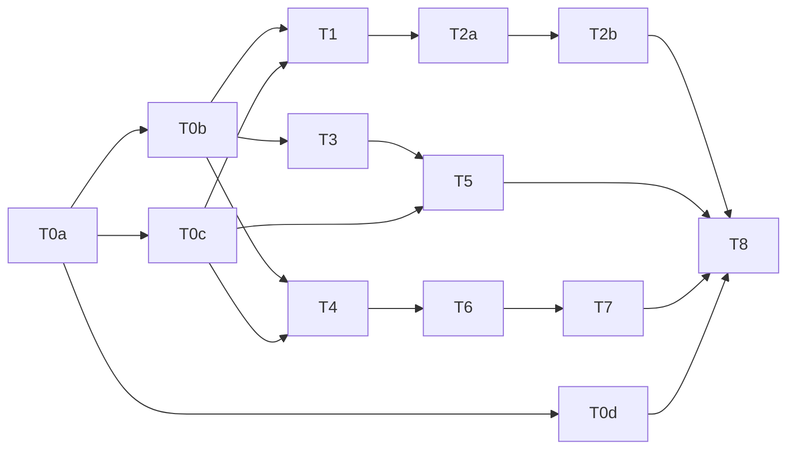

# Desk v1 — R0 build plan (MC-977)

**Status:** 2026-09-25, Merrin (ui-program-manager). A plan only. No feature code.
**Inputs:** `docs/THE_DESK_V1_UI.md` (owns UI + order), frames in `docs/desk_v1/frames/`, and the gap map `docs/desk_v1_gap_map.md` (entities #1–#20, conflicts C1–C9).
**R0 means:** interaction validation on **fixtures** with the `desk_v1` flag on. No new backend store, no publishing, no spend, no platform reads. Every command runs client-side over fixture data with Undo. R1 (durable stores, worker, real destinations) is out of scope here. The conflicts that block it are in gap map §5.

---

## Ground rules for every ticket

1. **Legacy `static/js/desk.js` is not where v1 lives.** v1 is new flat ES modules `static/js/desk-v1-*.js`, window-bridged like every other module (no `import` exists in `static/js`, so don't introduce one). desk.js gets exactly two edits across all of R0: the `openDesk` branch (T0a) and read-only mode (T0d). Splitting the hot file therefore means **not growing it**.
2. **One JS file, one CSS section, one smoke file per ticket.** T0a creates every file and every `<script>`/`<link>` tag up front, with stubs, so no later ticket touches `index.html`. CSS goes in a new `static/css/desk-v1.css` (precedent: `beacon.css`) with one pre-made `/* ── T<n> ── */` section per ticket. Git merges non-adjacent hunks cleanly.
3. **Fixtures are written once, in T0a**, from the frames: the "Windows beta testers" campaign, its 3 families (the restore-points article with 1 claim, the install video with 3 versions, the "30 testers wanted" post), 3 channels (`𝕏 @ron` direct, `in · Clayrune page` direct + held, `Clayrune blog` manual), 3 conversations, the render job + budget, and results with deliberate `delayed`/`n/a` gaps. A ticket that needs more adds rows **inside its own fixture section**.
4. **Status is glyph + word from the kit (T0b), never a local string.** Copy comes from the §9 vocabulary constants. That is what makes checks A12 and A15 testable once instead of per screen.
5. **Theme tokens only.** All three tones (default, `tone-warm`, `tone-editorial`) have to pass, not just dark + cream (gap map C9).
6. **Run the smoke after each merge, before the next one** (CLAUDE.md, 2026-09-10). The minimum per merge is `boot-smoke.mjs`, `desk.mjs` (legacy still green with the flag off) and the ticket's own `desk-v1-*.mjs`. T0c adds `drag-to-hire.mjs`.
7. **Phone (§11) is part of each surface ticket**, not a later pass. Hit targets ≥44px at ≤960px.
8. **Frames missing from the repo** (11a Home, 11d intake) or never drawn (Results, the rules popover, the Proposed state, phone): build from the doc text, then send a screenshot to Ron for a design check **before merge**. Don't invent a layout silently (gap map C6).

---

## Acceptance checks (§13), numbered for reference

A1 no node graph or connecting lines · A2 "All content" shows labelled groups, a filter shows only its items · A3 3 versions = 3 independent states · A4 channel→card adds a version, others untouched, Undo removes it · A5 Move only via ⋯, and it confirms · A6 the selection toolbar covers neither the selection nor the next line · A7 source → validation → the block clears only on "supports" or on accepting a revision, and rN increments · A8 manual destinations never show "Approve and schedule" · A9 the render button shows the maximum and is disabled when max > remaining · A10 forecasts labelled as estimates, missing ≠ 0 · A11 the Conversations switch is always visible and gaps are printed · A12 no "posts automatically" under each-piece review, no "free" · A13 worker offline → a Needs-you hold within one heartbeat, no heartbeat chip on Home · A14 times in the user's timezone · A15 all tones pass contrast, status readable in greyscale.

---

## Tickets

### T0a: flag, host, router, fixtures, file skeleton *(first; blocks everything)*
- **Files:** `server.py` (`_load_config` defaults: `desk_v1: False`, `user_timezone: ''` = use the host tz); `static/js/settings-drill.js` (toggle under Appearance or Labs, following its existing flag rows); `static/js/desk.js` (`openDesk` `:722` branches to `deskV1Open()` when the flag is on, ~10 lines); `static/index.html` (tags for all `desk-v1-*` files + `desk-v1.css`; the `renderDesk` call at `:1360` also calls `deskV1Render` when open); **new** `desk-v1-shell.js` (reuses the `__desk` modal host, opened maximized, gap map C8. Evaluate the existing `pages` surface style at `index.html:2666` before choosing. Route stack Home → campaign → item with `‹ <parent>` back. Route table pre-registered for every surface. Campaign-page skeleton with slots: summary, tab strip, tab body, right column, bottom tray), `desk-v1-fixtures.js`, stub `desk-v1-{kit,home,campaign,rules,review,calendar,video,conversations,results}.js`, `static/css/desk-v1.css` with per-ticket sections, `tools/smoke/desk-v1-harness.mjs` (flag on + fixtures + tone switcher), `tests/test_desk_v1_flag.py`.
- **Frame:** none (plumbing).
- **Closes:** A14 groundwork (a tz helper reads `user_timezone`, falls back to the host), the A1 harness (asserts no SVG connector paths on any v1 route), and MIG-04 routing.
- **Done when:** flag off → the legacy Desk is byte-identical in behaviour (`desk.mjs` green); flag on → every route renders its stub with working Back; `boot-smoke.mjs` green in all three tones.

### T0b: shared kit *(after T0a; parallel with T0c, T0d)*
- **Files:** `desk-v1-kit.js`, the `desk-v1.css` T0b section, `tools/smoke/desk-v1-kit.mjs`.
- **Contents:** the §9 vocabulary (15 version states, 6 campaign states, capability × permission copy, money wording) as constants plus a copy-lint helper; state label (glyph + word); channel badge (identity + capability glyph); toast with **Undo** + a client command bus (every command carries its inverse, plus a screen-reader announcement); `Add to… ▾` menu (the keyboard/click path, UX-05); the ⓘ popover; the **Posy box** (scope dropdown `About: <x> ▾`, suggestion bubble, 1–3 chips, input), built from the existing chat classes (`.agent-output`, `.agent-question-chip`, `.agent-input-row`, `.typing-indicator`), not forked. The UI doc names `CLAYRUNE_CONVERSATION_REDESIGN.md`, but the real source is `docs/CONVERSATION_REDESIGN_ACTION_PLAN.md`.
- **Frame:** 12e (wording rules), and the 12a Posy column.
- **Closes:** the A12 lint, the A15 greyscale rule for status (the glyph always carries the meaning).

### T0c: pointer-drag extraction *(after T0a; parallel with T0b, T0d)*
- **Files:** **new** `static/js/pointer-drag.js` (the generic state machine: activation threshold, touch long-press, `touch-action:none` class only while active, ghost rotated −3° **offset from the cursor**, target advertise/dim-with-reason, Esc cancel, focus return); `static/js/floor.js` `:630-800` refactored onto it with no behaviour change; the `desk-v1.css` T0c section.
- **Frame:** the 12a drag (the "Clayrune blog" ghost, dashed target, result line).
- **Done when:** `drag-to-hire.mjs` and `boot-smoke.mjs` are green, plus a new `tools/smoke/pointer-drag.mjs` covering mouse and touch emulation. **This is the one R0 ticket that can break a shipped feature**, so it gets Fenn's review before merge.

### T0d: legacy read-only when the flag is on *(after T0a; parallel with T0b, T0c)*
- **Files:** `static/js/desk.js` only (a `_deskReadOnly` guard on every write handler: Release, save body, push-back, kill, campaign state, voices/platform saves, harvest/triage/draft), plus a read-only banner; `tools/smoke/desk.mjs` (a flag-on case).
- **Closes:** MIG-04. Nobody else touches `desk.js` in R0, so this runs alongside anything.

### T1: Desk Home *(lane A)*
- **Files:** `desk-v1-home.js`, its CSS section, `tools/smoke/desk-v1-home.mjs`.
- **Scope (§2):** header (scope dropdown, Settings, Pause all); the promote box (typed text, drop, paste → `ProposeCampaign` → navigate to the Proposed campaign, T2b renders it); ≤3 Posy chips that fill but don't send; the 3-up campaign cards as drop targets with a result preview + Undo toast, and "Which campaign?" on an ambiguous drop (UX-03); Needs you grouped by kind, holds tinted, each row deep-linking to 12b/12c/12d; the Channels + Material shelves (capability glyphs, `＋ Connect`, four intake tiles, recent assets, drag **and** `Add to… ▾`); a **simulated worker heartbeat**, where offline → a hold row. Phone: promote box with `📎 🔗 🎙`, no drag.
- **Frame:** **11a, not in the repo** (C6). Design check with Ron before merge.
- **Closes:** A13, A4 (the Home half: channel → campaign card), A12 on Home.
- **Needs:** T0a, T0b, T0c.

### T2a: Campaign page + Content list *(lane A, after T1)*
- **Files:** `desk-v1-campaign.js`, its CSS section, `tools/smoke/desk-v1-campaign.mjs`.
- **Scope (§3.1–3.4, 3.6):** the summary bar (goal + mini progress → Results, channel badges, rule chips + Edit hook for T2b, Pause); tabs with needs-you-only counts; the toolbar (the 6 filters, the channel filter, the List/Calendar toggle hosting T4's view, `＋ New piece`); **All content = labelled groups** (NEEDS YOU / SCHEDULED / PUBLISHED collapsed), a specific filter = only its items; content card = a family with one row per version, no card-level status, primary Review/Watch & review/Open; the `⋯` menu with Move → confirm; all four drop rules from the §3.2 table with preview + Undo; the Posy box following the selection (campaign/card/version); the Add tray reusing T1's shelves, with attached channels dimmed. Phone per §11.
- **Frame:** **12a** (+ 12e).
- **Closes:** A2, A3, A4, A5, A12 on the page.
- **Why after T1:** the Add tray reuses T1's shelf renderer. That is the only hard link.

### T2b: Proposed state, Start sheet, rules popover, Posy instructions *(lane A, after T2a)*
- **Files:** `desk-v1-rules.js`, its CSS section, `tools/smoke/desk-v1-rules.mjs`. It reads the campaign page through the T0a slots and doesn't edit `desk-v1-campaign.js`. If a hook is missing, it gets added in T2a.
- **Scope:** §3.5 Proposed (`◇ Proposed` + `Start campaign`; an editable goal sentence with dashed parts; `? Assumed` popovers on cards/chips; at most one blocker card; an untracked goal = a warning, not a blocker, CMP-03); the CMP-05 review sheet (the full authority list in plain words + "Starting doesn't approve any piece") → Active + a fixture policy record; the §8 rules popover (grouped, effect previewed before applying, widening → an "authorized user" confirm); Posy instruction replies as **before → after + affected items + Undo**, where a widening instruction asks instead of applying (INS-03/04) and a durable instruction appears as a new rule chip (INS-02).
- **Frame:** **none drawn** (C6). Build from §3.5 and §8, then a design check.
- **Closes:** A12 (the review-mode copy on channel badges switches between "Publishes after approval" and "Publishes automatically" with the rule).
- **Blocked on Ron for the default only (C1):** build both review modes. The fixture default follows the doc (`You approve each piece`) until Ron rules.

### T3: Full-width review *(lane B)*
- **Files:** `desk-v1-review.js`, its CSS section, `tools/smoke/desk-v1-review.mjs`.
- **Scope (§4):** full-width, replacing the page; header (`n of m to review`, Review/Edit text, Show changes, `‹ ›` stepping through needs-you); the article body at ~640px with a video player variant; Show changes vs the last-reviewed revision; Edit text in place with autosave + a simulated conflict; a **selection toolbar below the selection** (Ask Posy ▾ / Edit / Comment); anchored comments; claims (the `⛔ No source` block bar → Add source → a simulated validator → supports / partial with an inline diff + `Accept → rN` / doesn't support); the right rail (the manual-handoff notice first, Where/When/Link, the claims list, Posy scoped to the article); a primary label chosen by capability × schedule, **disabled with a reason** while any claim is blocked or a revision is waiting; Publish now only in `⋯`; the binding explained once in ⓘ; video approval only on a rendered output (MED-05). Phone: actions in a bottom bar.
- **Frame:** **12b**.
- **Closes:** A6, A7, A8.
- **Needs:** T0a, T0b only, so it starts the same day as T1.

### T4: Calendar view *(lane C)*
- **Files:** `desk-v1-calendar.js`, its CSS section, `tools/smoke/desk-v1-calendar.mjs`. Reuse **helpers only** from `schedule-calendar.js` (range/label `:146,:414`, swipe `:868`) by window-bridging them. Its hour-row grid is the wrong shape, so don't reuse that.
- **Scope (§3.3):** rows = channels (with a hold on the row header), columns = days, today highlighted, weekends muted; a chip = one version (time, glyph + word, title), with `◇ Planned` dashed; This campaign / All campaigns; Week / Month; **drag a chip to reschedule**, allowed within the fixture approval's window, otherwise "Moving this needs approval again — continue?", which invalidates approval; click → 12b; the user timezone throughout, with a zone label only when the destination differs. Phone: an agenda list by day.
- **Frame:** **12f**.
- **Closes:** A14 (the UI half), A3 (chips per version).
- **Needs:** T0a, T0b, T0c. It renders into T2a's toggle slot through the T0a contract, so it can be built before T2a merges.

### T5: Video intake + director *(lane B, after T3)*
- **Files:** `desk-v1-video.js`, its CSS section, `tools/smoke/desk-v1-video.mjs`.
- **Scope (§5):** the intake sheet (4 tiles, a brief, material chips; Create → `Make a storyboard` + "No video-generation charge yet" + AI usage behind ⓘ; simulated Upload validation; Connect reports preview/import/link-only and **never fabricates a preview**, U11); the director (Source/Storyboard/Renders segmented control; a player status label when stale "Previous render · r2 — edits not rendered yet"; a proportional scene strip with drag reorder / edge trim / drop-insert / `•` on edits; Posy scoped Scene/Whole/version; the Pending edits card; the **render card** with Rate/Estimate/Maximum, the maximum's coverage line, budget left / after, `Render · up to $X` disabled with `Raise budget…` when max > remaining, and "You watch it before anything is published"; simulated job states in Renders).
- **Frame:** **11d, not in the repo** (C6) + **12d**.
- **Closes:** A9, A12 ("free").
- **Why after T3:** watch-and-review reuses T3's review layout with the player variant.

### T6: Conversations *(lane C, after T4)*
- **Files:** `desk-v1-conversations.js`, its CSS section, `tools/smoke/desk-v1-conversations.mjs`.
- **Scope (§6):** the tab + Home deep-link + a `Workspace ▾` all-campaigns scope; a **source switch always visible** (On our posts / Mentions / Discussions, with counts); rows with a reason line; a footer that prints the coverage gaps, and an empty list that never reads "no one is talking"; the thread (parent post, comments, the proposed reply as sent under `Replying as <identity> on <platform>`, click to edit); Send / Ask Posy to revise / Ignore / Assign ▾ / `✋ Take over` right-aligned; a stale or incomplete context → a hold bar + Send disabled (U14); Take over revokes, cancels queued and flags in-flight, and resume is explicit. **Send is simulated.** No platform write in R0.
- **Frame:** **12c**.
- **Closes:** A11.
- **Ordering note:** it has no code dependency on T4. Lane C just keeps one builder busy in §12 order.

### T7: Results *(lane C, after T6)*
- **Files:** `desk-v1-results.js`, its CSS section, `tools/smoke/desk-v1-results.mjs`.
- **Scope (§7):** goal first (big number / target, source + freshness in ⓘ); the forecast worded "Projected 26 of 30 · below target" + "estimate ⓘ" (never "on pace"); Posy's read with **one** experiment (`Set up experiment` creates a planned piece on Content, `Not now`); per-version "what went out" rows with the four outcome states; `delayed`/`n/a` and **never 0 unless measured**; costs separated, with cost-per-outcome only when every category is measured; diagnostics last (edit counts, never a gate).
- **Frame:** **none drawn** (C6). Build from §7, then a design check.
- **Closes:** A10.

### T8: R0 exit *(after all of the above)*
- **Files:** `tools/smoke/desk-v1-exit.mjs`, `docs/desk_v1_r0_exit.md`.
- **Scope:** every A1–A15 as a scripted check across all routes and all three tones; a greyscale screenshot pass; a copy lint over the rendered DOM; **U01–U16 scripted once the spec defines them** (needs spec); and the **5-user test** (a first-time user creates and reviews a draft campaign in under 5 minutes), measured rather than assumed. **Ron picks the testers.**

---

## Parallel lanes

| Lane | Tickets (in order) | Owns | Never touches |
|---|---|---|---|
| Groundwork | T0a, then T0b ∥ T0c ∥ T0d | shell, fixtures, index.html, kit, pointer-drag.js, floor.js, desk.js | — |
| A: Home → campaign | T1 → T2a → T2b | home, campaign, rules | desk.js, floor.js, index.html |
| B: review → video | T3 → T5 | review, video | same |
| C: time, talk, numbers | T4 → T6 → T7 | calendar, conversations, results | same |

- **At most 3 builders at once** after groundwork (one per lane). That matches the burn-rate rule: approving R0 is not approving N agents, and three is a ceiling, not a target. One builder running the lanes in sequence is the cheap default.
- **Merge order within a day:** groundwork first, then whichever lane is green, **one merge at a time, smokes between merges**.
- **Hot files and who holds them:** `index.html` (T0a only), `desk.js` (T0a's ~10 lines, then T0d), `floor.js` (T0c only), `desk-v1-fixtures.js` (T0a; others only inside their own section), `desk-v1.css` (per-ticket sections), `desk-v1-kit.js` (T0b; a later need goes through a small kit PR, not an edit inside a surface branch).

## Owners (proposed)

T0a/T0b/T0d/T2b: **Tobin** (builder). T0c: **Tobin**, reviewed by **Fenn**. T1/T2a/T3/T4/T5/T6/T7: **Tobin** or **Tilda** (UI). Merrin reviews each against its frame before merge. Design checks for the undrawn surfaces (T1, T2b, T5 intake, T7) go to Ron as screenshots.
